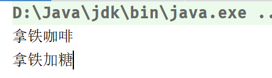
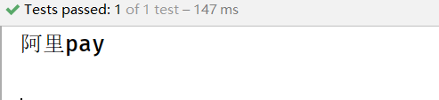

# 设计模式

## 工厂模式

### 简单工厂模式

* 抽象产品：定义产品的规范，包括产品的主要特性、功能
* 具体产品：实现或继承抽象产品的子类
* 具体工厂：提供创建产品的方法，通过该方法来获取产品

> **缺点：1. 违反开闭原则（每增加一个品种，都要修改工厂类，工厂类的职责过重，代码臃肿）；2.违反了单一职责原则（工厂类不仅创建对象，还承担了产品选择的逻辑，职责过多）**

```java
//抽象产品
public interface Coffee {
    public String getName();

    public void addSugar();
}


//具体产品1
public class AmericanCoffe implements Coffee {
    @Override
    public String getName() {
        return "美式咖啡";
    }

    @Override
    public void addSugar() {
        System.out.println("美式加糖");
    }
}


//具体产品2
public class LatteCoffee implements Coffee {
    @Override
    public String getName() {
        return "拿铁咖啡";
    }

    @Override
    public void addSugar() {
        System.out.println("拿铁加糖");
    }
}

//具体工厂
public class CoffeeFactory {
    public static Coffee createCoffee(String type) {
        Coffee coffee = null;
        if ("american".equals(type)) {
            coffee = new AmericanCoffe();
        } else if ("latte".equals(type)) {
            coffee = new LatteCoffee();
        }
        return coffee;
    }
}


Coffee latte = CoffeeFactory.createCoffee("latte");
System.out.println(latte.getName());
latte.addSugar();
```

 


### 工厂方法模式

* 抽象产品：定义产品的规范，包括产品的主要特性、功能
* 具体产品：实现或继承抽象产品的子类
* 抽象工厂：提供创建产品的接口，通过访问具体的工厂方法来创建产品
* 具体工厂：实现抽象工厂中的抽象方法，完成具体产品的创建

> **解决了简单工厂模式的单一职责原则和开闭原则，每个产品对应一个工厂类，增加了系统复杂度**

```java
//抽象产品
public interface Coffee {
    public String getName();

    public void addSugar();
}


//具体产品1
public class AmericanCoffe implements Coffee {
    @Override
    public String getName() {
        return "美式咖啡";
    }

    @Override
    public void addSugar() {
        System.out.println("美式加糖");
    }
}


//具体产品2
public class LatteCoffee implements Coffee {
    @Override
    public String getName() {
        return "拿铁咖啡";
    }

    @Override
    public void addSugar() {
        System.out.println("拿铁加糖");
    }
}

//抽象工厂
public interface CoffeeFactory {
    public Coffee createCoffee();
}

//具体工厂1
public class AmericanCoffeeFactory implements CoffeeFactory {
    @Override
    public Coffee createCoffee() {
        return new AmericanCoffe();
    }
}

//具体工厂2
public class LatteCoffeeFactory implements CoffeeFactory {
    @Override
    public Coffee createCoffee() {
        return new LatteCoffee();
    }
}


CoffeeFactory americanCoffeeFactory = new AmericanCoffeeFactory();
Coffee americanCoffee = americanCoffeeFactory.createCoffee();
System.out.println(americanCoffee.getName());
americanCoffee.addSugar();
```


## 策略模式

### 简单策略模式

* 策略接口：定义所有策略的共同行为
* 具体策略类：实现策略接口，封装具体的行为或算法
* 上下文类：持有策略接口的引用，面向接口编程，动态使用不同策略

```java
//策略接口
public interface PayStrategy {
    void pay(int amount);
}

//具体策略接口1
public class AliPay implements PayStrategy {
    @Override
    public void pay(int amount) {
        System.out.println("使用支付宝支付：" + amount + "元");
    }
}

//具体策略接口2
public class WeChatPay implements PayStrategy {
    @Override
    public void pay(int amount) {
        System.out.println("使用微信支付：" + amount + "元");
    }
}

//上下文类
public class PayContext {
    private PayStrategy payStrategy;

    public PayContext(PayStrategy payStrategy) {
        this.payStrategy = payStrategy;
    }

    public void executePay(int amount) {
        payStrategy.pay(amount);
    }
}

//使用
PayContext context = new PayContext(new AliPay());
context.executePay(100);
```


### 策略模式+工厂模式(重点)

> **解决实际项目中多类型if-else、switch判断的业务，eg：多种登录方式（微信登录、邮箱登录、账号密码登录）、支付方式（微信支付、支付宝支付、信用卡支付）等**

```java
//支付方式枚举
public enum PayTypeEnum {
    ALI_PAY(0, "阿里pay"),
    WECHAT_PAY(1, "微信pay"),
    CREDITCARD_PAY(2, "信用卡pay");

    public static PayTypeEnum getPayEnum(int code) {
        //遍历所有的枚举字段
        for (PayTypeEnum payType : values()) {
            if (payType.code == code) {
                return payType;
            }
        }
        throw new IllegalArgumentException("不支持的支付类型: " + code + "，支持的类型有: " +
                Arrays.stream(PayTypeEnum.values())
                        .map(e -> e.name + "(" + e.code + ")")
                        .collect(Collectors.joining(", ")));
    }

    private int code;
    private String name;

    PayTypeEnum(int code, String name) {
        this.code = code;
        this.name = name;
    }

}


//策略接口
public interface PayStrategy {
    PayTypeEnum getPayTypeEnum();

    public void pay(int count);
}

//具体策略接口1
@Component
public class WechatPay implements PayStrategy {
    @Override
    public PayTypeEnum getPayTypeEnum() {
        return PayTypeEnum.WECHAT_PAY;
    }

    @Override
    public void pay(int count) {
        System.out.println("wechat pay");
    }
}

//具体策略接口2
@Component
public class AliPay implements PayStrategy {
    @Override
    public PayTypeEnum getPayTypeEnum() {
        return PayTypeEnum.ALI_PAY;
    }

    @Override
    public void pay(int count) {
        System.out.println("阿里pay");
    }
}

//具体策略接口3
@Component
public class CreditCardPay implements PayStrategy {
    @Override
    public PayTypeEnum getPayTypeEnum() {
        return PayTypeEnum.CREDITCARD_PAY;
    }

    @Override
    public void pay(int count) {
        System.out.println("信用卡pay");
    }
}


//工厂类
@Component
public class PayFactory {

    @Resource
    private List<PayStrategy> payStrategyList;

    private final Map<PayTypeEnum, PayStrategy> payStrategyMap = new HashMap();


    public PayStrategy getPayStrategy(int payType) {
        PayTypeEnum payEnum = PayTypeEnum.getPayEnum(payType);
        return payStrategyMap.get(payEnum);
    }

    @PostConstruct
    public void setPayStrategyList() {
        payStrategyList.forEach(item -> payStrategyMap.put(item.getPayTypeEnum(), item));
    }
}


//调用
@Resource
private PayFactory payFactory;


@Test
public void test1() {
    PayStrategy payStrategy = payFactory.getPayStrategy(4);
    payStrategy.pay(10);
}
```

 

