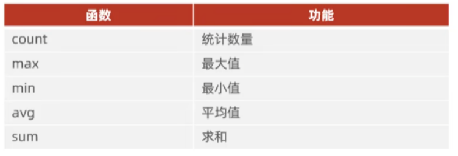
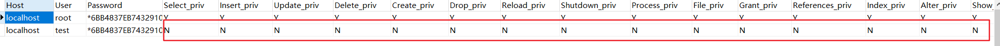
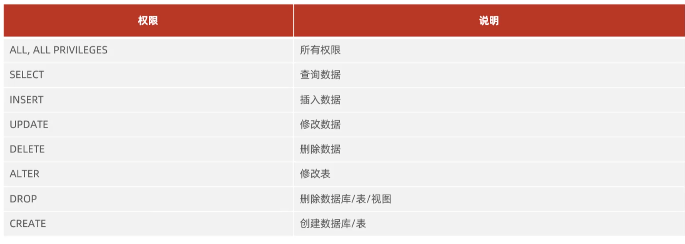

# MySQL

* 语法
  * SQL语句以分号结束，可以单行或多行书写
  * MySQL数据库SQL语句不区分大小写，关键字建议使用大写
  * 单行注释：`--`或`#`；多行注释：`/* 注释内容 */`
* SQL分类
  * DDL（Data Definition Language）：数据定义语言，定义数据库、表、字段
  * DML（Data Manipulation Language）：数据操作语言，对表中数据进行增删改操作
  * DQL（Data Query Language）：数据查询语言，查询表中数据
  * DCL（Data Control Language）：数据控制语言，创建数据库用户、控制数据库访问权限


## 数据库操作

> `[...]`中括号里面的命令代表的是可选参数，非强制要求

### 查询所有数据库

```mysql
show databases;
```


### 使用指定数据库

```mysql
use 数据库名;
```


### 创建数据库

```mysql
create database [if not exists] 数据库名;
```


### 删除数据库

```mysql
drop database [if exists] 数据库名
```


### 查询当前使用的数据库

```mysql
select database();
```


### 导入外部数据库

> **如果将一个数据库`转储SQL文件-结构和数据`，如果这个SQL文件很大（eg：45MB），使用GUI界面导入会导致卡死，此时可以使用原生命令行导入数据**

```bash
# 在cmd或命令行中执行
mysql -u root -p

# 选择需要导入的数据库
use xxx;

# 导入sql文件
source F:\4.27\jieyakj_db_auth.sql
```


## 表操作

### 查询所有表

```MYSQL
show tables;
```


### 查询表结构

```mysql
desc 表名
```


### 查询当前表的创建语句

```mysql
show create table 表名
```


### 创建表

> **如果不指定符号位，默认创建时为有符号位**

| 数据类型 |  大小   | signed（有符号范围） | unsigned（无符号范围） |                             描述                             |
| :------: | :-----: | :------------------: | :--------------------: | :----------------------------------------------------------: |
| tinyint  | 1个字节 |       -128~127       |         0~255          |         类似于Java的Byte，<br />eg：tinyint unsigned         |
|   int    | 4个字节 |  -2^31^ ~ 2^31^ -1   |      0 ~ 2^32^ -1      |                     类似于Java的Integer                      |
|  bigint  | 8个字节 |  -2^63^ ~ 2^63^ -1   |      0 ~ 2^64^ -1      |                       类似于Java的Long                       |
|  float   | 4个字节 |         ....         |          ....          |                      类似于Java的Float                       |
|  double  | 8个字节 |         ....         |          ....          | 类似于Java的Double；<br />eg：score  double(4,1) 表示分数最共4位，<br />即小数点前3位数字，小数点后保留一位数字 |
| decimal  |         |  依赖于M精度和D标度  |   依赖于M精度和D标度   |                     类似于Java的Decimal                      |

| 数据类型 | 大小          | 描述                                                         |
| -------- | ------------- | ------------------------------------------------------------ |
| char     | 0-255 bytes   | **定长字符串，性能好；eg：char(10)如果字符串长度不足10位，则会以空格填充** |
| varchar  | 0-65535 bytes | 变长字符串，性能较差，会根据内容自动计算存储长度             |

| 数据类型  | 格式                     | 描述     |
| --------- | ------------------------ | -------- |
| date      | YYYY-MM-DD               | 日期值   |
| time      | **`HH:MM:SS`**           | 时间值   |
| year      | YYYY                     | 年份值   |
| datetime  | `YYYY-MM-DD HH:MM:SS`    | 具体时间 |
| timestamp | 年月日时分秒构成的时间戳 | 时间戳   |

```mysql
create table 表名(
	字段1  类型 		  		[comment “注释信息”],
    字段2  类型 符号位 		  [comment “注释信息”],
	....
    字段n  类型(长度) 		   [comment “注释信息”]
) [comment “注释信息”];
```


### 删除表

```mysql
drop table [if exists] 表名;
```


### 清空表数据

```mysql
truncate table 表名
```


### 重命名表

```mysql
alter table 旧表名 rename to 新表名;
```


### 字段操作

#### 添加字段

```mysql
alter table 表名 add 字段名 类型(长度) [comment "注释信息"];
```


#### 修改字段

```mysql
-- 修改字段类型
alter table 表名 modify 字段名  新数据类型(长度);


-- 重命名字段名
alter table 表名 change 旧字段名 新字段名  类型(长度);
```


#### 删除字段

```mysql
alter table 表名 drop 字段名;
```


## CRUD

### 插入数据

> **字符串和日期型数据使用引号保存**

```mysql
-- 插入一条或多条数据(values里面的值顺序一一对应表中定义字段的顺序)
insert into 表名 values(值1,值2....), (值1,...);

-- 插入指定字段的一条或多条数据
insert into 表名(字段名1,字段名2,...) values(值1,值2....), (值1,...);
```


### 修改数据

```mysql
update 表名 set 字段1=值1,字段2=值2 [where 条件]
```


### 删除数据

```mysql
delete from 表名 [where 条件]
```


### 查询数据

* **查询模版的编写顺序**

```mysql
select 
	字段列表 
from 
	表名 
where 
	分组前的条件
group by 
	分组字段
having 
	分组后的过滤条件
order by 
	排序字段列表
limit 
	分页参数
```

* **SQL语句的执行顺序**

```tex
1. from 表名
2. where 分组前的条件
3. group by 分组字段 having 分组后的过滤条件
4. select 字段列表
5. order by 排序字段
6. limit 分页参数
```

> **注意：如果我们对表取了别名之后，我们不能再where条件或其它位置继续使用`表名.列名`方式了，因为from语句是最先执行的**


#### 基本查询

```mysql
-- 查询全部记录
select * from 表名 [别名];

-- 查询指定字段记录
select 字段1 [as '别名'],.... from 表名;

-- 条件查询
select 字段列表 from 表名 where 条件;
```

 

 

**注意：`between 最小值 and 最大值`不能交换最小值和最大值的顺序，否则查询不到**


##### 去重处理

```mysql
-- 去除完全重复的行
select distinct 字段列表 from 表名;

-- 去除指定字段的重复
select 字段列表 from 表名 group by 指定字段
```

eg：

```tex
1.去掉完全重复的行 → 用 DISTINCT
    id  name
    1   张三
    1   张三
    2   李四
SELECT DISTINCT id, name FROM 表;


2.去掉指定字段的重复 → 用 GROUP BY 指定字段
    id  name
    1   张三
    1   张三丰
SELECT id, name FROM 表 GROUP BY id;
```


#### 分组查询

> * **执行顺序：where>聚合函数>having**
> * **where语句是分组之前进行过滤，不满足where条件，不参与分组；而having是分组之后对结果过滤**
> * **`where不能对聚合函数判断；而having可以`**
> * 分组之后，查询的字段一般为聚合函数、分组字段，查询其它字段无意义

```mysql
select 字段列表 from 表名 [where 分组前的条件] group by 分组字段名 [having  分组后的条件]
```


##### 聚合函数

> **将一列数据作为一个整体，进行纵向计算，其中某列的null值不参与聚合函数运算**

 


#### 排序

> **如果是多字段排序，当第一个字段值相同时，才会根据第二个字段进行排序，以此类推。**
>
> * **asc（默认值，可省略不写）：升序**
> * **desc：降序**

```mysql
select 字段列表 from 表名 order by 字段1 排序方式,字段2 排序方式....
```


#### 分页查询

> * **起始索引从0开始，`起始索引=(页码-1)*每页显示记录数`**
> * **如果查询第一页数据，起始索引可以省略，简写为`limit 每页显示记录数`**

```mysql
select 字段列表 from 表名 limit  起始索引,每页显示记录数;
```


## 基础

### 函数

#### 字符串函数

* **concat(str1,str2....strn)：将str1~strn的拼接成一个字符串**

* **lower(str)：将str全部转为小写**

* **upper(str)：将str全部转为大写**

* **trim(str)：将str去除首尾空格**

* **substring(str, start,len)：将str从start索引位置截取len个长度，索引位置从1开始**

* lpad(str,n,pad)：用pad字符串对str的左边进行填充到n个字符

* rpad(str,n,pad)：用pad字符串对str的右边进行填充到n个字符

  ```mysql
  -- eg:工号统一为5位数,不足5位数，左边用0填充
      -- id  work_no
      -- 1   1
      -- 2   2
  update t_user set work_no=lpad(work_no,5,"0")
      -- id  work_no
      -- 1   00001
      -- 2   00002
  ```

  

#### 数值函数

* ceil(x)：向上取整

* floor(x)：向下取整

* mod(x,y)：返回x/y的模

* rand()：返回0~1的随机数

* round(x,y)：将x四舍五入，保留小数点后y位（**eg：round(x,0)保留x后0位小数，即将x取整数部分**）

  

#### 日期函数

* **now()：返回当前日期和时间**

* curdate()：返回当前日期

* curtime()：返回当前时间

* **year(date)：获取指定date的年份**

* **month(date)：获取指定date的月份**

* **day(date)：获取指定date的日期**

* **datediff(date1,date2)：计算date1-date2之间的间隔天数**

* date_add(date, INTERVAL x  type)：在当前date上增加x 类型的时间

  ```sql
  -- eg:在当前时间上增加30天、年、月
  select date_add(create_time,INTERVAL 30 DAY)
  select date_add(create_time,INTERVAL 30 YEAR)
  select date_add(create_time,INTERVAL 30 MONTH)
  ```

  


#### 流程函数

* **case  `expr  when` val1 then  res1 [when val2 then res2 ...] else default end：`等于表达式`,当expr等于val1时，返回res1，当expr等于val2时，返回res2..... ，否则默认返回default **

  ```sql
  -- eg: 如果城市是北京、上海就显示一线城市,重庆就是二线城市,其它的都是三线城市
  case city when "北京" then "一线城市" 
  		  when "上海" then "一线城市" 
  		  when "重庆" then "二线城市" 
  		  else “三线城市” end
  ```

* **case  `when` 表达式1 then res1  [when 表达式2 then res2 ...] else default  end：`条件筛选表达式`，当表达式1满足时，返回res1，当表达式2满足时返回res2，否则默认返回default** 

  ```sql
  -- eg:成绩大于90为优秀，大于80为合格，否则良
  case when score>=90 then "优秀"  
  	 when score>=80 then "合格" 
  	 else "良" end
  ```

* **if(value,t,f)：如果value为true，则返回t，否则返回f**

  ```sql
  select if(true,"这是真的","这是假的") as test
  ```

* **ifnull(value1,value2)：如果value1不是null值，则返回value1，否则返回value2**

  ```sql
  select ifnull(null,"不是空的值哦") as test
  ```


### 约束

**概念：约束是作用于表中字段上的规则，用于限制存储在表中的数据**

**目的：保证数据库中数据的正确性、有效性和完整性**

**分类：**

|         名称         |                       描述                       |     关键字      |
| :------------------: | :----------------------------------------------: | :-------------: |
|     **非空约束**     |             **限制该字段不能为null**             |  **not null**   |
|     **唯一约束**     |     **保证该字段在数据库中是唯一、不重复的**     |   **unique**    |
|     **主键约束**     |        **一行数据的唯一标识，非空且唯一**        | **primary key** |
|     **默认约束**     | **保存数据时，如果未指定字段的值，则采用默认值** |   **default**   |
| 检查约束（mysql 8+） |               保证字段满足某个条件               |      check      |
|       外键约束       |  建立两张表之间的联系，保证数据的一致性和完整性  |   foreign key   |


```SQL
-- eg:创建t_user表
create table t_user(
	id  	int 			primary key 	auto_increment 		comment "主键id，自增",
    name 	varchar(10) 	not null 		unique 				comment "姓名",
    age 	int 			check(age>0 && age<=120)  			comment "年龄",
    status 	char(1) 		defualt "1" 						comment "状态"
) comment "用户表";
```

**`注意：多个约束之间采用空格分隔`**


#### 外检约束

##### 逻辑约束

> **如果我们不做外键约束，当主表对应数据删除时，从表还会存在关联主表的外键记录，会造成数据不一致的问题**

```sql
-- 主表：部门表
t_dept
	id
	name

-- 从表：员工表（拥有外键的表）
t_user
	id
	name
	-- 外键：关联主表的主键
	dept_id
```


##### 物理约束

```sql
-- 创建表添加
create table 表名(
	字段1 ...,
    ...
    外键1 ... ,
    
    constraint 自定义外键名称 foreign key(外键1)  references 主表名(对应主表的字段)
)

-- 使用命令添加
alter table 从表名 add constraint 自定义外键名称  foreign key (从表的外键列) references 主表名(对应主表的字段)  [on  update  行为  on delete 行为]
```

**外键删除、更新行为**

* **restrict（no action，默认行为）：当父表更新、删除对应记录时，首先检查该记录是否有对应外键，如果有则不允许删除、更新**
* **cascade（两张表同时更新、删除记录）：当父表更新、删除对应记录时，首先检查该记录是否有对应外键，如果有，则也删除、更新外键在子表的记录**
* **set null：当父表删除记录时，首先检查该记录是否有对应外键，如果有则设置子表中的外键值为null（前提：外键值允许为null）**

```sql
-- eg：给t_user表添加外键约束，新增和删除时设为级联操作
alter table t_user add constraint fk_user_dept_id  foreign key (dept_id) references t_dept(id)  on  update  cascade  on delete cascade
```


### 多表查询

#### **概述**

**建表关系：**

* **1对多（多对1）：在`多`的一方添加`一`的外键关系**
* **多对多：增加中间表保存两张表的外键关系**
* **1对1：在任意一方添加另一方的外键关系，这个外键通常是`unique`类型的，为了区分1对多**


**多表查询：**

* **普通多表查询（`隐式内连接`）：需要使用判断语句消除笛卡尔积，否则查询数量=表A x 表B**

  ```sql
  -- 普通多表查询,查询的数量为a和b的组合，axb条记录
  select * from a,b 
  -- 普通多表查询,消除笛卡尔积
  select * from a,b  where a.bid=b.id
  ```

* **连接查询：**

  * **内连接：查询A和B的交集部分数据**
  * **左外连接：查询左表所有数据、两表交集部分数据**
  * **右外连接：查询右表所有数据、两表交集部分数据**
  * **自连接：当前表与自身连接查询，自连接必须使用表别名**

* **子查询**


#### 注意事项

> **`编写关联关系查询的时候，一定要提前想好返回的数据到底是什么`（eg：交集、并集、某表基础+其它信息、自己和自己的关系）**

1. **如果只想查询多个表的交集部分，只能使用内连接**
2. **如果想查询以某个表为基础，含有其它表的信息，用外连接**
3. **如果想查询多个表的并集部分，用联合查询**
4. **如果想查询自己和自己的关系，用自连接**


#### 内连接

> **内连接查询的是两个表的`交集部分`**

* ```sql
  -- 隐式内连接（普通多表查询，去除笛卡尔积）
  select a.* ,b.* from a,b where a.bid=b.id
  ```

* ```sql
  -- 显式内连接查询
  select a.* ,b.* from a  join b on  a.bid=b.id
  
  select a.* ,b.* from a  inner join b on  a.bid=b.id
  ```
  


#### 自连接

1. **如果自连接的表对象是本身，那么就把自己的这张表拆成两个表来看，根据条件来组合查询**

2. **自连接查询的表必须起别名**

```mysql
# 隐式内自连接(特殊的内连接)
select a.* ,b.* from t_self a, t_self b where a.self_id=b.id

# 显式内自连接（特殊的内连接）
select a.* ,b.* from t_self a join t_self b on a.self_id=b.id

# 显式外自连接（特殊的左连接）
select a.* ,b.* from t_self a left join t_self b on a.self_id=b.id
```


#### 外连接

> **左右连接查询的是`某个表为基础，包含交集`的部分**

* **左连接：查询以左表（a）为基础，包含左表、左右表交集的部分**

  ```mysql
  select a.*,b.* from a left [outer] join b on a.id=b.aid
  ```

* 右连接：查询以右表（b）为基础，包含右表、左右表交集的部分（可以改写为左连接）

  ```mysql
  select a.*,b.* from a right [outer] join b on a.id=b.aid
  ```


#### 联合查询

1. **联合查询的多张表列数、查询对应位置字段类型必须一致，且可以合并多张表（无限拼接）**
2. **union会对合并后的数据去重+排序，union all直接拼接合并的数据（不去重、不排序、速度快于union）**

```mysql
# 合并相同表的不同条件查询结果并自动去重
select id,name from a where ...
union 
select id,name from a where ...

# 合并相同表的不同条件查询结果（没有去重处理）
select id,name from a where ...
union all
select id,name from a where ...

# 合并不同两个表的查询结果（不去重、对应位置字段类型一样，但字段名称不一样）
# => 合并的结果返回列以第一张表的列名为准，即id、name
select id,name from a where ...
union all
select uid,username from b where ...
```


#### 子查询

* 普通子查询（返回单列、多行单列）

* **行、表子查询（返回一行多列、多行多列）**

  ```mysql
  # 查询表a中，(a1,a2)的组合 等于  表b满足查询条件的唯一一行(b1,b2)组合的全部记录
  select a.* from a where (a1,a2)=(select b1, b2 from b where xxx)
  
  # 查询表a中，(a1,a2)的组合 存在于 表b满足查询条件的(b1,b2)组合中的全部记录
  select a.* from a where (a1,a2) in (select b1, b2 from b where xxx)
  ```

  


## 事务

### 事务操作

> **在mysql中，每条执行语句的事务是独立的且自动提交的**

* **提交事务**

  ```mysql
  commit;
  ```

* **回滚事务**

  ```mysql
  rollback;
  ```

  


#### 配置事务（了解）

* 查看事务提交方式

  ```mysql
  # 返回1（自动提交）、0（手动提交）
  select @@autocommit;
  ```

* **临时设置当前窗口下的事务提交方式**

  > **当在窗口下设置此条语句后，当前窗口的所有DML语句都需要提交事务才能更新数据**

  ```mysql
  # 可选值：0（手动提交）、1（自动提交）
  set @@autocommit=0;
  ```


#### 手动控制事务（重点）

* 开启事务

```mysql
# 二选一，以下两种方式都可以开启事务
begin;
start transaction;
```


[55. 基础-事务-并发事务演示及隔离级别_哔哩哔哩_bilibili](https://www.bilibili.com/video/BV1Kr4y1i7ru?spm_id_from=333.788.videopod.episodes&vd_source=6ce2a6eb6cbcb840f00c1778af71ce3c&p=55)


## 用户、权限管理

### 用户管理

#### 查询mysql系统用户

```mysql
use mysql;
select * from user;
```


#### 创建用户

> **主机名中可以设置当前主机访问或任意主机访问该数据库，`新创建的用户没有任何操作权限`**
>
> * **localhost：当前主机下可以访问该数据库**
> * **%：任意主机下都可以访问该数据库**

```mysql
create user '用户名'@'主机名' identified by '密码';
```


eg：

 



 


#### 修改用户密码

```mysql
alter user '用户名'@'主机名' identified with mysql_native_password by '新密码';
```


#### 删除用户

```mysql
drop user '用户名'@'主机名';
```


### 权限管理

> **授权时，数据库名和表名可以使用`*`进行通配，代表所有**


#### 查询权限

```mysql
show grants for '用户名'@'主机名';
```


#### 授予权限



```mysql
grant 权限列表1,权限列表2,... on 指定数据库名.指定表名 to '用户名'@'主机名';
```


#### 撤销权限

```mysql
revoke 权限列表1,.... on 指定数据库名.指定表名 from '用户名'@'主机名';
```

