# JS

## VS Code代码提示插件

* Auto Import（开发者：steoates）
* Path Intellisense（开发者：Christian Kohler）
* Prettier - Code formatter（开发者：Prettier prettier.io）
* Vue 2 snippets
* VueHelper
* Vue 3 Snippets


## ES6新特性

>  打开VSCODE，创建html，通过`shift+!`快捷键可快速生成html5代码


### let 和var

```js
    <script>
        {
            var a=1; 	//var声明的为全局作用域
            let b=1;	//let声明的为局部作用域
        }
        console.log(a);
        console.log(b);//会出现跨域错误: Uncaught ReferenceError: b is not defined
    </script>
```

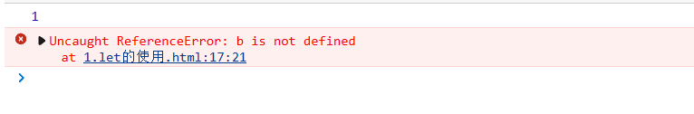


### const常量声明

```js
<script>
        const PI=3.14;
        PI=1; //对常量再次赋值会报错
</script>
```

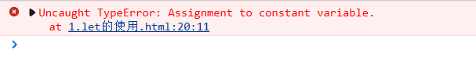 


###  解构和展开

#### 对象

##### 解构

###### 变量使用

> **将对象按照key名称匹配，key必须一致，顺序无关，按需解构指定对象Key**

```js
const data={ 
    name:"zs", 
    age:20, 
    info:
    {
    	id:1
    }
}

// 将data里面的name解构、age解构并重命名为userAge、info对象解构成新的对象，并再次解构里面的id
const {name,  age:userAge, info:{id}}=data
console.log(name)
console.log(userAge)//这里只能打印userAge,因为重命名了
console.log(id)		//这里只能打印id,因为将info重新解构里面的id了
```

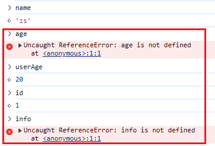 


###### 函数参数解构

```js
const data={ 
    name:"zs", 
    age:20
}

// 函数参数上解构data这个对象，同理保证Key一致
function add({name,age}){
    console.log(name,age)
}

add(data)
```

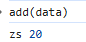 


##### 展开

> 使用`{...对象名}`展开对象，会展开成对象里面K=V形式

###### 对象合并

```js
const user = {id:1,name:'张三', age:18}

// 将user全部属性展开，修改age，生成全新对象
const newUser = { ...user, age: 20 }
```


###### 批量展开和过滤

> **解构和展开同时使用时，展开必须放最后一位**

```js
// 解构user对象的id值，剩下其它属性保留不动,赋值给other对象(other为展开,必须放解构的最后一位)
const { id, ...other } = user

// 解构other对象
const {name,age}=other

// 把id剔除，剩下属性丢给接口
api.submit({ ...other })
```


##### 对象展开+解构

```js
const user = { name: "小王", age: 25 };

// 将handleUser方法的形参对象解构为name、age属性
function handleUser({ name, age }) {
  console.log("对象解构", name, age);
}


handleUser({ name: "小王", age: 25 });

// 展开user对象，等价于传入一个新对象name=小王、age=25
handleUser({ ...user });
```


#### 数组

##### 解构

> **按顺序匹配，变量名称任意，和数组元素无关**

```js
const arr = ["苹果","香蕉","橙子"]
const [a,b,c] = arr
console.log(a,b,c) // 输出：苹果 香蕉 橙子

const [first, ,third] = arr
console.log(first,third) // 跳过第二个，输出： 苹果，橙子
```


##### 数组展开

```js
const a = [1,2]
const b = [3,4]
// 展开a、b的所有元素
const all = [...a, ...b]

// 展开a的所有元素，并添加新元素
const newA = [...a, 3]
```


### 字符串(重点)

> **通过`${变量名或方法}`即可获取之前的值，前提是字符串是` `` `**

```js
<script>   
    function fun() {
        return "这是一个函数";
    }

    let name="eobard"
    let age=20
    
    let info = `我是${name}，今年${age + 10}了, 我想说： ${fun()}`;
    console.log(info);

</script>
```

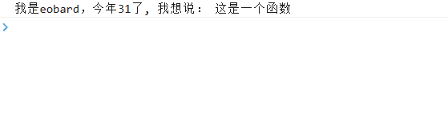 

### lambda表达式

> **lambda表达式写的方法不能获取到this指代的值，可用`对象.属性`获取到**

```JS
<script>
    //声明一个方法
    var output=params=>console.log(params);
    //调用方法
    output("hello world")

    //声明一个方法
    var sum=(a,b)=>{
        return a+b
    };
    //调用方法
    console.log(sum(10,20));

</script>
```

 


#### lambda+解构表达式(重点)

```js
<script>		
		//lambda表达式+解构
        //将传入的对象解构出name属性并输出
        var output = ({name}) => console.log("hello," +name);
        output(person);
</script>
```

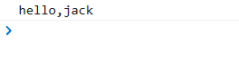 


### 对象优化

####  声明对象

```js
// 声明对象简写
const age = 23
const name = "张三"

//若对象的属性k和对应的v的变量名一样,则可以省略k:v形式,直接输入v
const person2 = { age, name }//声明对象简写
console.log(person2);
```

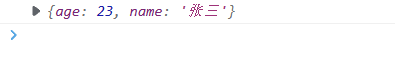 

####  深拷贝：复制对象

```js
const target = { a: 1 };
const source1 = { b: 2 };
const source2 = { c: 3 };

//将source1和source2的对象信息复制给target对象
Object.assign(target, source1, source2);//{a:1,b:2,c:3}


//  拷贝对象（深拷贝）
let p1 = { name: "Amy", age: 15 }
let someone = { ...p1 }
console.log(someone)  	//{name: "Amy", age: 15}
```

 

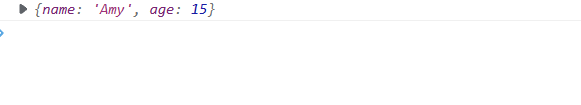 

#### 对象的函数定义

```js
let person3 = {
    name: "jack",
    //lambda表达式函数中this不能使用，只能用对象.属性
    eat2: food => console.log(person3.name + "在吃" + food),

    //函数的简单定义（重点）
    eat3(food) {
        console.log(this.name + "在吃" + food);
    }
};
person3.eat2("b");
person3.eat3("c");
```

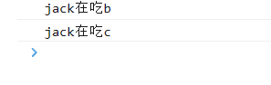 


### map、reduce

```JS
let arr = ['1', '20', '-5', '3'];

//将arr的每个数据都*2
arr=arr.map(item=>item*2);//map中可传入lambda表达式
console.log(arr);
```

 


```js
    /**
    *   reduce形参
            1、previousValue （上一次调用回调返回的值，或者是提供的初始值（initialValue））
            2、currentValue （数组中当前被处理的元素）
            3、index （当前元素在数组中的索引）
            4、array （调用 reduce 的数组）
    */
   
   let res=arr.reduce((pre,curr)=>{
        console.log("上一次处理后："+pre);
        console.log("当前正在处理："+curr);
        return pre + curr;
   })

   console.log(res);
```

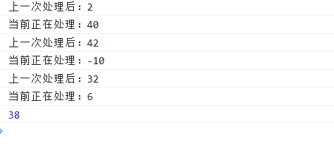 


### promise异步编排

> **Promise内部类似于生产者executor，最多只能真正生效一次：`要么调用 resolve，要么调用 reject`**
>
> * 调用`resolve(返回的数据)` → Promise变成**成功 (fulfilled)**
>
> * 调用`reject(错误)` → Promise 变成**失败 (rejected)**
>
> 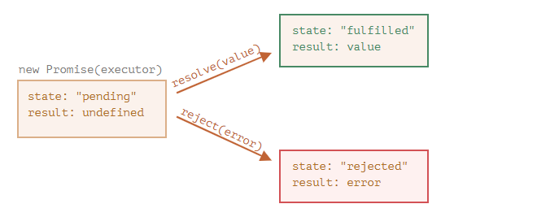

```js
new Promise(resolve => resolve("done")) //返回done字符串

new Promise((resolve, reject) => {
      resolve("done");	//返回done字符串
  	  reject(new Error("…")); // ❌完全无效，状态已经定死，忽略
});

new Promise((resolve,reject)=>{
  reject(new Error('出错')); // ✔生效：状态变成失败
  resolve(666);             // ❌无效，改不了
})


new Promise((resolve, reject) => {
    setTimeout(()=>{
        resolve("成功")
    },1000)

    reject("出错") // ❗这行是同步代码，立刻执行！比定时器快得多，所以最终状态变为rejected 
})
```


#### .then

>  **`then`方法内部返回的值会作为全新Promise对象（即永远会返回一个新的Promise对象，实现无限套娃）的resolve值，交给下一个then，因为`then`默认只接收 resolve，失败会交给`catch`**
>
>  * return **普通值**：下一个 then立刻拿到这个值执行
>  * return **Promise 对象**：链条会等待这个异步做完，再跑下一个 then

```js
new Promise(resolve => resolve(1))//当前Promise的resolve返回1
.then(v => v + 1)   // 生成新的promise的resolve返回2
.then(v => console.log(v)); // 生成新的promise的resolve返回undefined，因为没有返回新的数据
```


#### .catch

> **catch只捕获 Promise 走向 rejected状态**

```js
new Promise((resolve,reject)=>{
  reject(new Error("出错啦"))
}).catch(err=>{
  console.log(err)
})

new Promise(resolve => resolve(1))  // 返回新的Promise，不会进入catch
	.then(v => {
    	throw new Error("then里面抛出错误");	//返回新的Promise，会执行reject方法，进入catch
	})
    .catch(err => {
        console.log(err.message); // then里面抛出的错误
    })
```


##### eg：ajax请求

```js
 //Ajax中成功使用resolve(data)，交给then处理;失败使用reject(err)，交给catch处理p.then().catch()
        let p=new Promise((resolve,reject)=>{
            $.get({
                url:"data/user.json",
                success:function(data){
                    let {id,name}=data;
                    console.log("用户信息"+id+" "+name);
                    //将data传入then后续处理
                    resolve(data)
                },
                error:function(err){
                    reject(err)
                }
            })
        }).then((data)=>{
                $.get({
                    url:`data/addr${data.id}.json`,
                    success:function(data){
                        let {code,addr}=data;
                        console.log("地址信息"+code+" "+addr);
                    },
                    error:function(err){
                        console.log(err);
                    }
                })
        }).catch(()=>{
            console.log("ajax出现错误了");
        })
```

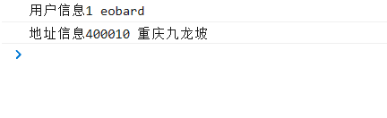 

#### 无限套娃(重点)

> **`在then()方法中可以继续new Promise来无线套娃.then()往下掉方法`**

```js
let p = new Promise((resolve, reject) => { 
            $.ajax({
                url: "mock/user.json",
                success: function (data) {
                    resolve(data);
                },
                error: function (err) {
                    reject(err);
                }
            });
        }).then((obj) => { 
            //继续new Promise往下无限套娃
            return new Promise((resolve, reject) => {
                $.ajax({
                    url: `mock/user_corse_${obj.id}.json`,
                    success: function (data) {
                        resolve(data);
                    },
                    error: function (err) {
                        reject(err)
                    }
                });
            })
        }).then((data) => { 
            $.ajax({
                url: `mock/corse_score_${data.id}.json`,
                success: function (data) {
                    console.log("查询课程得分成功:", data)
                },
                error: function (err) {
                }
            });
        }).catch((err)=>{	//出问题交给catch处理
            console.log(err)
        })
```


##### 轻微封装ajax请求

```js
 function get(url, data) { 
            return new Promise((resolve, reject) => {
                $.ajax({
                    url: url,
                    data: data,
                    success: function (data) {
                        resolve(data);
                    },
                    error: function (err) {
                        reject(err)
                    }
                })
            });
        }


	get("mock/user.json")
            .then((data) => {
                console.log("用户查询成功~~~:", data)
                return get(`mock/user_corse_${data.id}.json`);
            })
            .then((data) => {
                console.log("课程查询成功~~~:", data)
                return get(`mock/corse_score_${data.id}.json`);
            })
            .then((data)=>{
                console.log("课程成绩查询成功~~~:", data)
            })
            .catch((err)=>{ //失败的话catch
                console.log("出现异常",err)
            });
```


#### async/await

##### async

> **被async修饰的函数，必然返回一个Promise对象**
>
> * **如果函数正常执行，返回的是Promise.resolve(data)**
> * **如果函数内部报错，返回是Promise.reject(error)**

```JS
async function fn() { 
    return x 
}
// 等价于
function fn() { 
    return Promise.resolve(x) 
}


async function fn() { 
    throw err 
}
//等价于
function fn() { 
    return Promise.reject(err) 
}
```


##### await

> **只能被写在async修饰的函数内部，等待指定Promise对象状态变成fulfilled /rejected后继续执行后续代码**
>
> * **Promise 成功：取出resolve里面的返回值，继续往下执行；**
> * **Promise 失败：直接在 await 这一行抛出异常（throw error），后面代码不再执行，需要`try/catch`捕获。**

```js
async function loadJson(url) { 
  let response = await fetch(url); // 等待fetch方法拿到资源，解析里面的数据后继续往下执行

  if (response.status == 200) {
    let json = await response.json(); // 等待获取json()数据后，解析里面的数据继续往下执行
    return json;					  //返回由Promise包裹的json对象，后续需要获取此数据，需要then方法或其它await
  }

  throw new Error(response.status); //如果上面有异常，直接返回由Promise包裹的reject
}

//调用
loadJson('https://javascript.info/no-such-user.json').catch(alert); 
```

==注意：async、await适用于某一段逻辑，必须等异步操作完成之后，才允许继续往下执行（渲染页面、赋值、后续请求）==

```js
// js是解释型语言，把请求发送出去后会直接向下执行，此时请求可能还没完成，这时userRef.value赋值就是undefined
const user=getById(id)
userRef.value=user

// 如果使用async、await配合，那么就必须等待请求完成后才会赋值，此时userRef.value就会得到真正的数据
const user=await getById(id)
userRef.value=user
```


### export、import模块化(重点)

> **在一个模块中export、import可以有多个（export 可以导出多个命名模块），export default仅有一个**
>
> * **输出多个值、对象、方法，使用export，import时必须带上`{}`**
> * **输出单个值、对象、方法，使用export default，import时不需要`{}`**
> * **export default与普通的export最好不要同时使用**

<font color=red>类似于java的导包功能</font>

`user.js`

```js
var name = "eobard"
var age = 22
var add = (a, b) => a + b

//export不仅可以导出对象，一切JS变量都可以导出。比如：基本类型变量、函数、数组、对象。
export {name,age,add}
```


`fun.js`

```js
//导出utils的对象,里面包含一个方法
export const utils = {
    ouput(params) { 
        console.log("hello",params);
    }

}

//导出一个对象,导入的时候可以自定义名字
export default {
    printf(params) { 
        console.log("hello2",params);
    }
}
```


`utils.js`

> 一个公共的暴露的全局工具包，它将其它文件聚合并导出，后续只需要从utils导入对应名称即可

```tsx
// 将helpers.js里面的login/logout方法从工具类里面导出 
export {login, logout} from './helpers.js';

// 将默认导出重新导出为 User
export {default as User} from './user.js';
```


`main.js`

```js
//导入user.js的name,age和add方法
import {name,age,add} from './user.js'

//导入fun.js的utils对象
import utils from './fun.js'

//导入fun.js的对象并起名为print
import print from './fun.js'

// 直接从工具类中导入多个其它包的方法
import {login, logout,User} from './utils.js'

console.log(name + " " + age);
console.log(add(1, 3));
console.log(utils.ouput("eobard"));
console.log(print.printf("thawne"));
```

> **`注意:如果导出的时候没有用default关键字，则导入的时候必须和导出的变量名对应;只有用了default关键字，则导入时可以自定义名字`**


