# Pytorch

## 开始

### Anaconda

#### 下载与初始化

* 下载anaconda（需科学上网）：[Index of / (anaconda.com)](https://repo.anaconda.com/archive/)

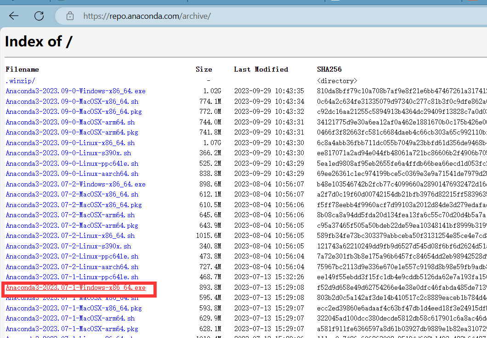


* 更改镜像地址**（可选）**

在anaconda powershell prompt中输入指令

 

```bash
# 使用清华源
conda config --add channels http://mirrors.tuna.tsinghua.edu.cn/anaconda/pkgs/free/
conda config --add channels http://mirrors.tuna.tsinghua.edu.cn/anaconda/pkgs/main/
conda config --add channels http://mirrors.tuna.tsinghua.edu.cn/anaconda/cloud/conda-forge/
conda config --add channels http://mirrors.tuna.tsinghua.edu.cn/anaconda/cloud/msys2/
conda config --add channels http://mirrors.tuna.tsinghua.edu.cn/anaconda/cloud/pytorch/
conda config --set show_channel_urls yes

# anaconda默认的源地址
http://mirrors.tuna.tsinghua.edu.cn/anaconda/cloud/pytorch/
http://mirrors.tuna.tsinghua.edu.cn/anaconda/cloud/msys2/
http://mirrors.tuna.tsinghua.edu.cn/anaconda/cloud/conda-forge/
http://mirrors.tuna.tsinghua.edu.cn/anaconda/pkgs/main/
http://mirrors.tuna.tsinghua.edu.cn/anaconda/pkgs/free/
```

<font color="red">**注意：最好把pytorch安装完了之后才切换清华的镜像地址**</font>


* 更改虚拟环境路径：放入anaconda安装路径里面的envs文件夹里

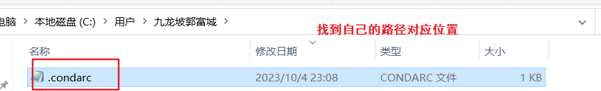

```tex
envs_dirs:
  - D://python//anaconda//envs
```

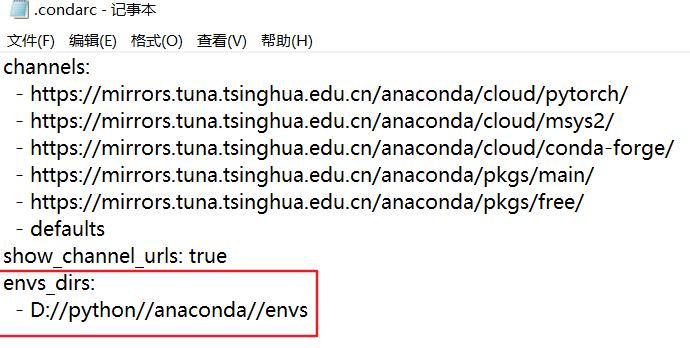


#### 命令

##### 创建虚拟环境

**`中途安装输入y`**

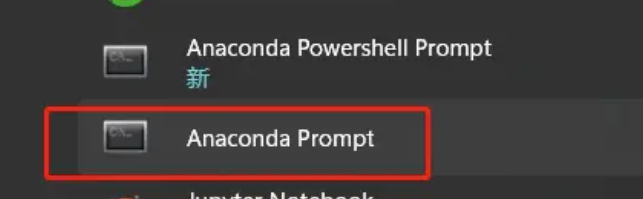 

```bash
conda create -n xxx

# 指定版本或包
conda create -n xxx python=自己要的python版本

# 如果你要指定多个包 可以用
conda create -n xxx python=3.5 numpy pandas
```

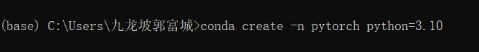 


##### 切换环境

```cmd
# 查看环境大全
conda info -e

#显示可用环境
conda env list

#激活某个虚拟环境
conda activate xxx

# 查看当前环境下的包
conda list


#放弃当前虚拟环境
conda deactivate

#参考帮助
conda env --help
```

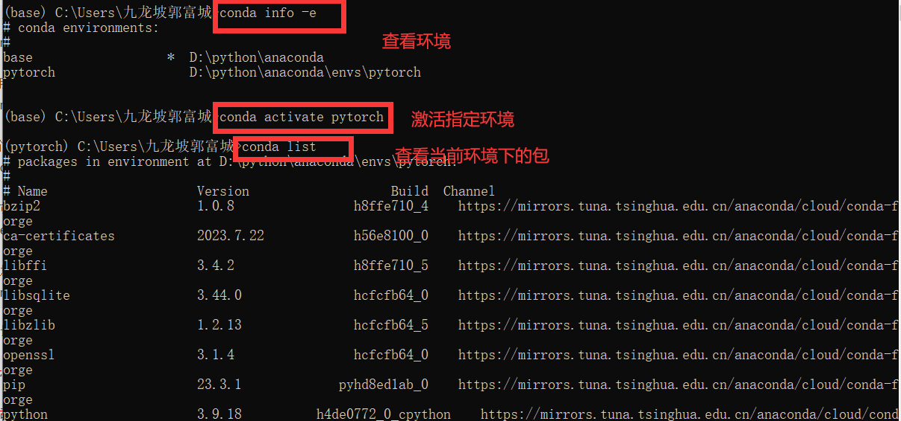


另外在jupter中切换环境还需要额外操作

```cmd
　 1.首先在anaconda中创建一个虚拟环境，安装python2.7版本

　　2.激活python2.7，命令为”activate D:\Anaconda\envs\py27“

　　3.在python2.7下安装ipykernel，安装命令为“pip install ipykernel“

　　4.输入命令“python -m ipykernel install --name python2 ”

　　5.输入命令"jupyter notebook"后打开jupyter查看，已经安装好了python2环境，可以进行切换了
```


##### 更新、安装指定环境包

```cmd
conda install python=3.10 
#安装固定版本包(也可以用该方法进行升降级)

conda install packagename 
#为当前环境安装某包

conda install -n envname packagename 
#为某环境安装某包

conda search packagename 
#搜索某包

conda updata packagename 
#更新当前环境某包

conda update -n envname packagename 
#更新某特定环境某包

conda remove packagename 
#删除当前环境某包

conda remove -n envname packagename 
#删除某环境环境某包
```


##### 克隆、删除环境

```cmd
#创建一个新环境想克隆一部分旧的环境
conda create -n xxx_clone --clone xxx_origin

#删除某个环境
conda remove -n xxx --all

# 若未指定python版本会报错，这时需要如下删除命令
conda env remove -n xxx(env_name)
```


##### 导入导出配置环境

> 非常有用，比如你想帮朋友安装和你一模一样的环境，你可以直接导出一个配置文件给他，就能免除很多人力安装调试

```cmd
#导出环境配置文件
conda env export > environment.yml

#导入环境
conda env create -f environment.yml
```


### 深度学习环境安装

#### 驱动检测

> **Pytorch需要N卡，A卡需另外找教程安装深度学习相关，`确保当前计算机安装了显卡驱动`**


==**1.确保有显卡驱动**==

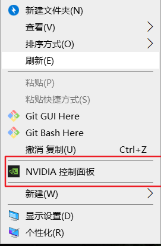 

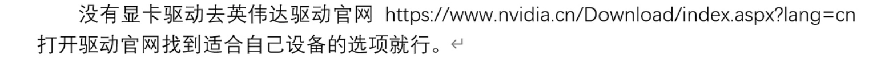

**注意：出现了上述即证明已经安装驱动了，如果没有安装驱动，需要下载当前电脑对应的显卡驱动**


==**2.打开cmd输入`nvidia-smi`，弹出界面即可**==

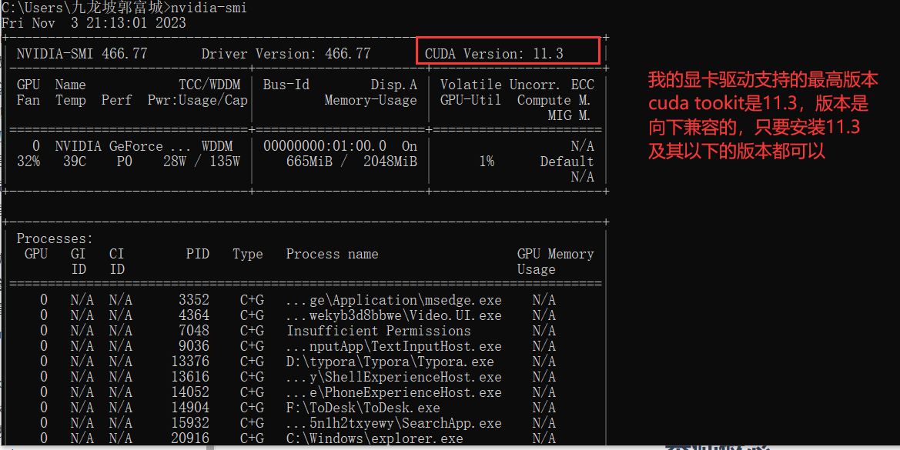


#### pytorch安装

> **打开[pytorch官网](https://pytorch.org/)，不建议安装1.8和1.9两个版本**


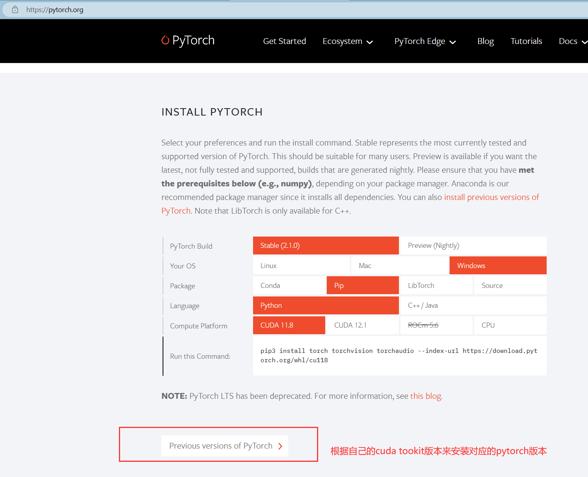


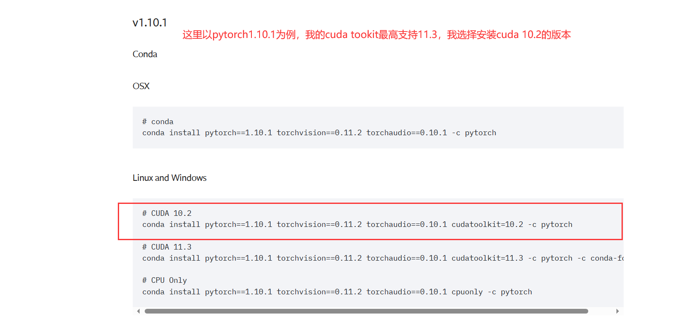  

```bash
# CUDA 10.2, 可能需要科学上网
conda install pytorch==1.10.1 torchvision==0.11.2 torchaudio==0.10.1 cudatoolkit=10.2 -c pytorch
```

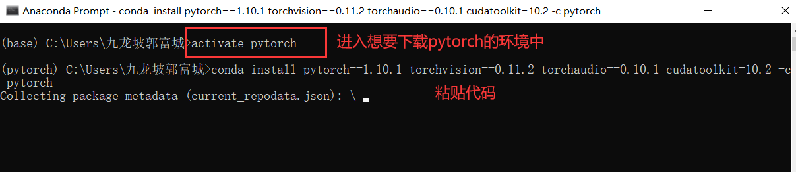

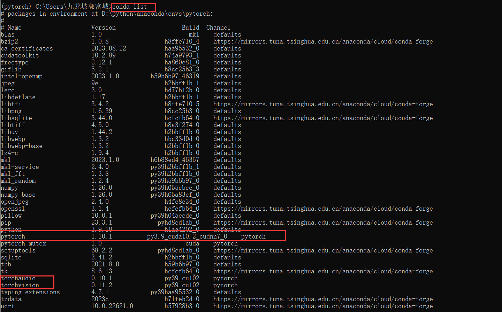


##### 安装其它库

```
pip install torchsummary
pip install pandas
pip install matplotlib==3.5.0
pip install sklearn==0.0
```

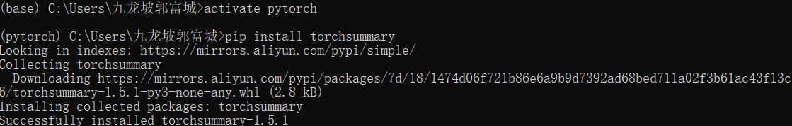

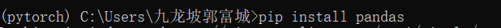 

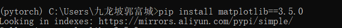 

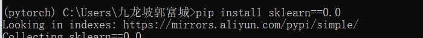 


##### 注意

* > **如果没有GPU，也是可以安装pytorch的，则是使用CPU运行，不能调用GPU加速**

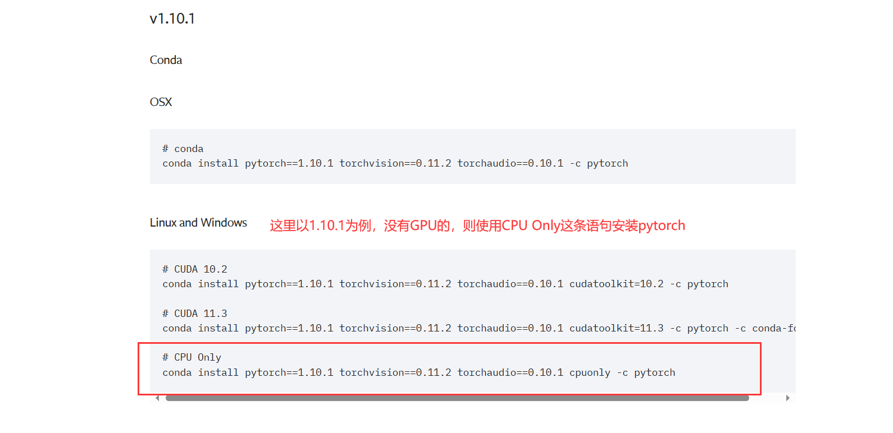  

* **如果已经切换了清华的镜像地址并且一直安装不起pytorch依赖，则需要把清华的镜像地址切回anaconda的默认地址（`下载与初始化章节的第二步`），然后使用科学上网工具，再次运行安装代码即可**


### pycharm配置Anaconda

#### 旧版pycharm

**`以pycharm 2022为例`**

1. 打开pycharm，点击python解释器这里，点击添加解释器

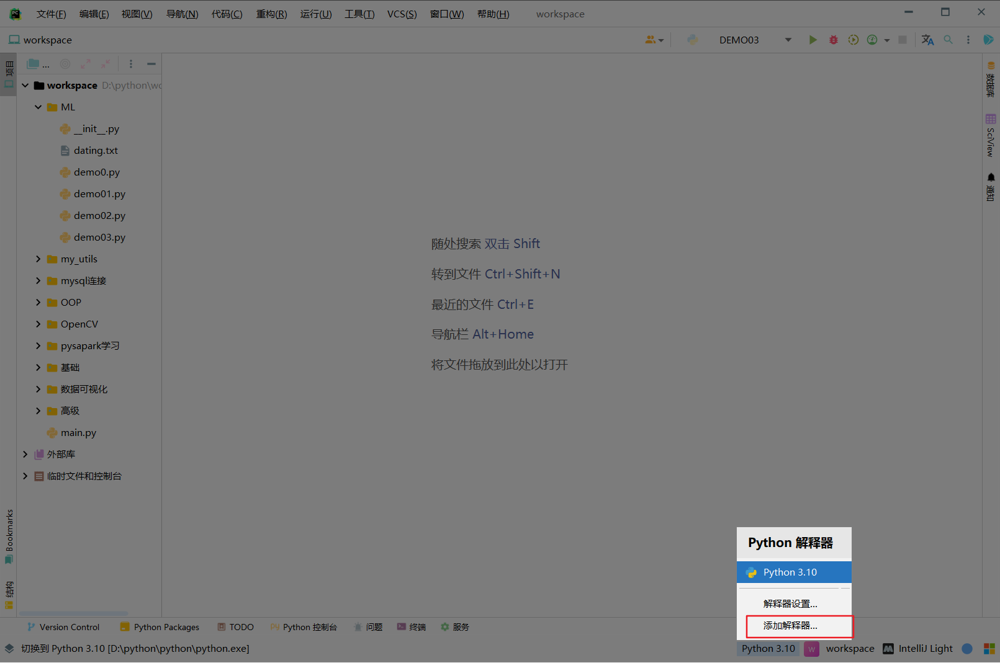


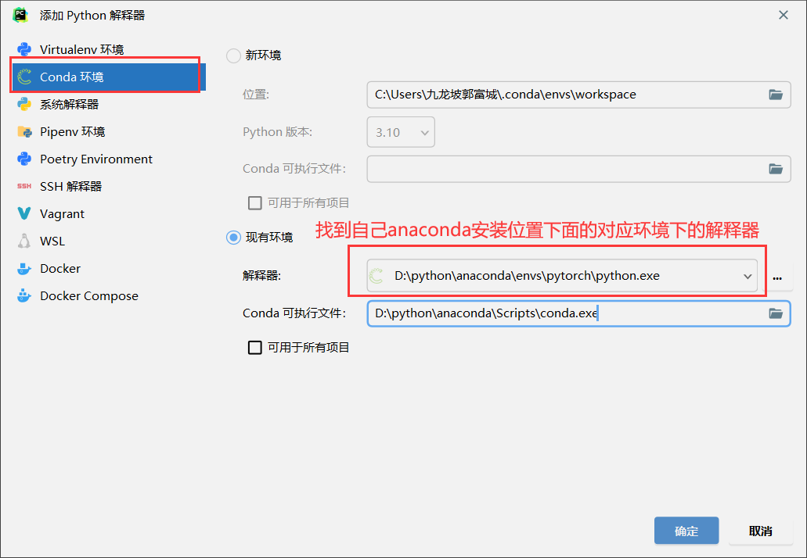


#### 新版pycharm

**`2023年的pycharm`**

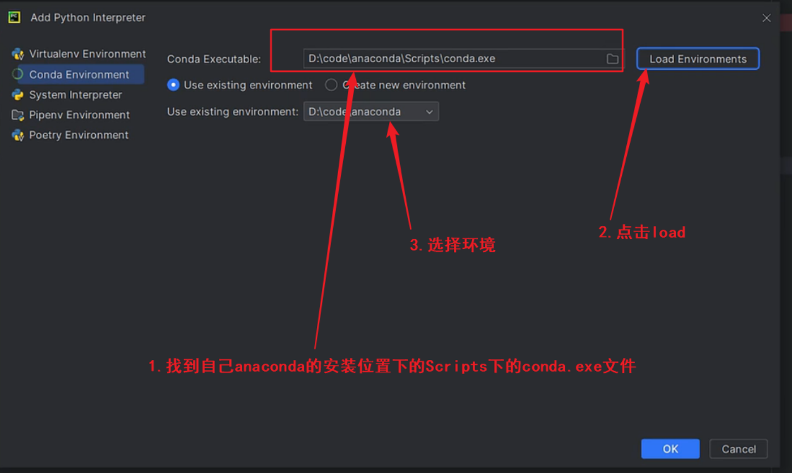


#### pytorch测试

```python
import torch

# 打印GPU是否可用:False表示安装失败,需要重新安装
flag = torch.cuda.is_available()
print("GPU是否可用:",flag)

device = torch.device("cuda" if torch.cuda.is_available() else "cpu")
print(device)
print("显卡信息:",torch.cuda.get_device_name(0))
print("创建0-12的4*3的tensor,并送入GPU中:",torch.arange(0,12).view(-1,3).cuda())

# CUDA version
cuda_version = torch.version.cuda
print("CUDA Version:",cuda_version)

# CuDNN version
cudnn_version = torch.backends.cudnn.version()
print("CuDNN version:",cudnn_version)
```

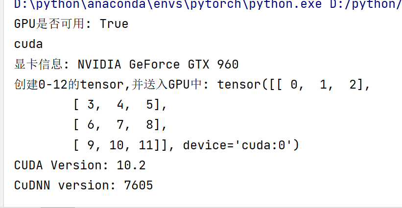


## 基础概念

### 什么是Pytorch

> **一个基于Numpy的科学计算包，向它的使用者提供了两大功能：**

* 作为Numpy的替代者, 向用户提供使用GPU强大功能的能力
* 做为一款深度学习的平台, 向用户提供最大的灵活性和速度


### Tensors张量

> **类似于Numpy中的ndarray数据结构, 最大的区别在于Tensor可以利用GPU的加速功能**


## 预处理

### one-hot编码

```python
import pandas as pd
# 设置dataframe打印对其
pd.set_option('display.unicode.ambiguous_as_wide', True)
pd.set_option('display.unicode.east_asian_width', True)
pd.set_option('display.width', 180) # 设置打印宽度(**重要**)

# 模拟读取文件
data = pd.DataFrame({"学号":[1001,1002,1003,1004],
                    "性别":["男","女","女","男"],
                    "学历":["本科","硕士","专科","本科"]})

print("one-hot编码之前：\n",data)

df1 = pd.get_dummies(data)
print("对所有类别进行one-hot编码：\n",df1)

# 对学历类别编码
tmp=pd.get_dummies(data["学历"])
# 将其结果加入data后面
df2 = data.join(tmp)
print("对学历类别进行one-hot编码：\n",df2)
```

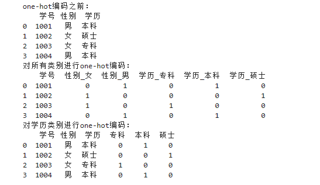 


### 填充nan

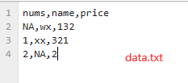 

```python
import pandas as pd

data=pd.read_csv("data.txt")

# 取出data的所有行元素、截取索引为0～1的列
features=data.iloc[:,:2]
print("填充前：\n",features)
# 将缺少的值用当前列的均值填充
print("填充后\n",features.fillna(features.mean()))
```

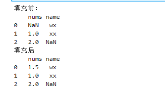 


## 基本语法

### 基本元素操作

> **`所有torch.xx(column)创建张量的方法,如果只传入一个参数代表的是创建1*column的矩阵`**


#### empty

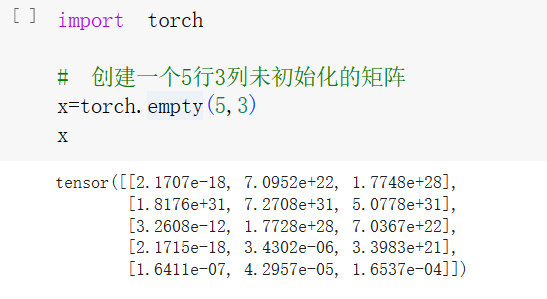 

> **当创建一个未初始化的矩阵时,它本身不包含任何确切的值,分配给矩阵的内存中有什么数值就赋值给这个矩阵, 本质上是毫无意义的脏数据**


#### **rand和randn**

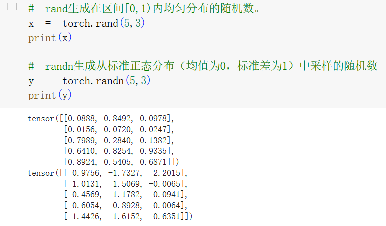


#### **randn_like、ones_like、size**

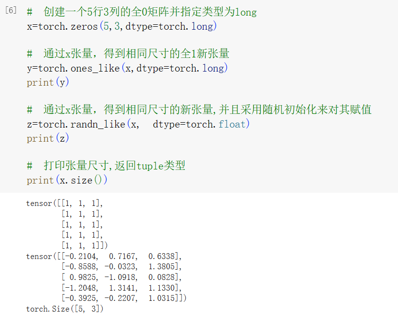


#### **zeros**

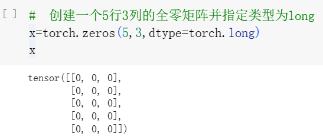 


#### **ones**

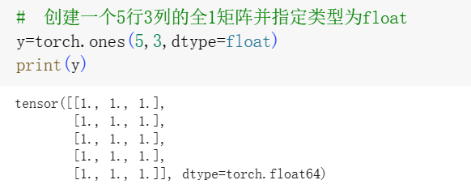 


#### arrange

```python
# 生成一个0-5元素的2*3的tensor
x=torch.arange(6).view(2,3)
x
```

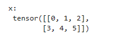 


#### **自定义数据创建张量**

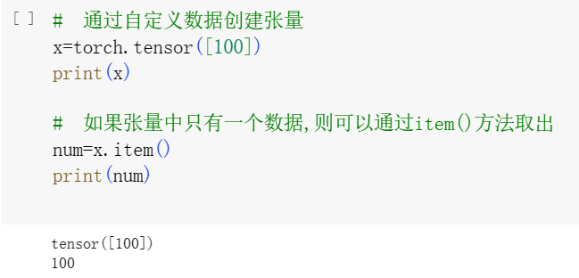 


### 基本运算操作

#### 四则操作

```python
import torch

x=torch.ones(3,3,dtype=torch.long)
y=torch.ones(3,3,dtype=torch.long)
# 法一：直接相加
print("直接相加\n",x+y)

# 法二：add方法
out=torch.add(x,y)
print("add方法\n",out)

# 法三:原地置换(y=y+x)
y.add_(x)
print("原地置换\n",y)


# 法一:减、乘、除方法名()
# 法二:减、乘、除方法名_():原地置换
print("减法\n",torch.sub(y,x))
print("乘法\n",torch.mul(x,y))
print("除法\n",torch.div(x,y))
```

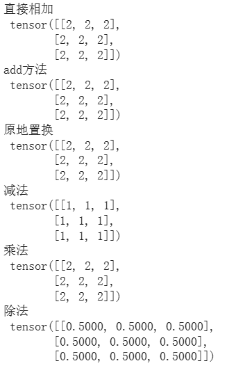 


#### 拼接操作

```python
# 生成一个0-5元素的2*3的tensor
x=torch.arange(6).view(2,3)
y=torch.tensor([[7,8,9],[10,11,12]])
print("x:\n",x,"\ny:\n",y)

# 将y的tensor按照列延伸对应拼接在x的tensor后
z=torch.cat((x,y),dim=0)
print("按照列延伸：\n",z)

# 将y的tensor按照行延伸对应拼接在x的tensor后
w=torch.cat((x,y),dim=1)
print("按照行延伸：\n",w)
```

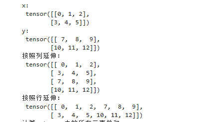 


#### 切片

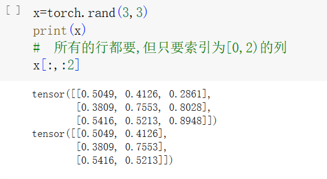 

**如果是一维tensor，切片默认为列方向；如果是二维tensor，切片默认是行方向，如果想操作列方向则[：，index：end]**


##### 三维tensor的切片

```python
# 
import torch

# 三维tensor
a = torch.arange(0, 16).view(4, 4).unsqueeze(0)
print(a,a.shape)
print("保留所有的批次,对每个批次切索引为0-1的行,列不变:\n",a[:,:2])
print("保留所有的批次,对每个批次切索引为0-1的行,切索引0-2的列:\n",a[:,:2,:3])
```

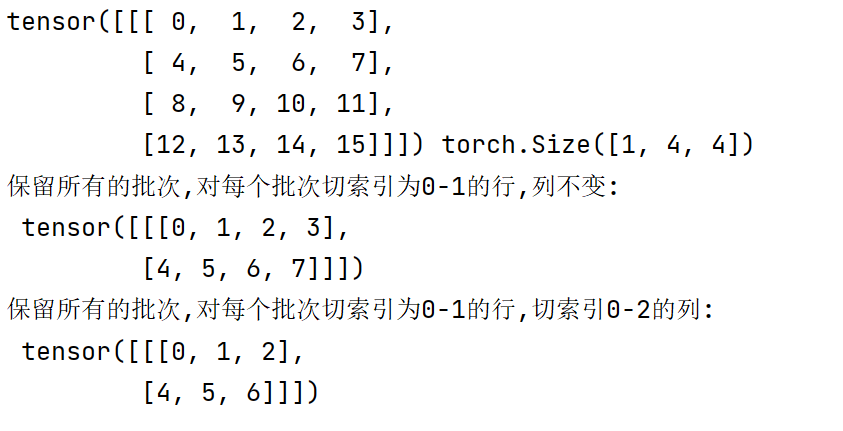


```python
import torch

# 三维tensor
a = torch.arange(0, 12).view(3, 4).unsqueeze(1)
print(a,a.shape)
print("切批次的索引为0-1,对这个批次切列索引为0-2的:\n",a[:2,:,:3])
```

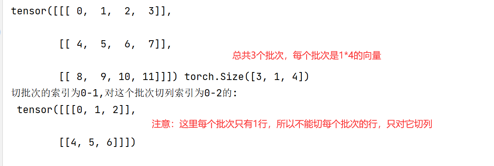


#### 改变张量形状

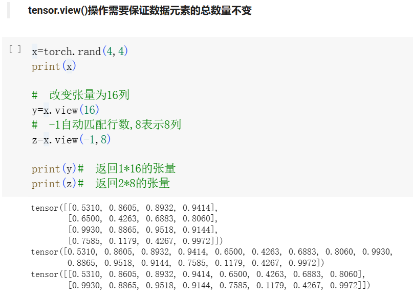


#### 类型转换


##### tensor转numpy

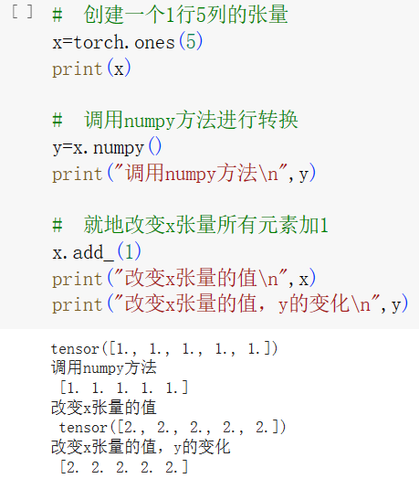 


##### numpy转tensor

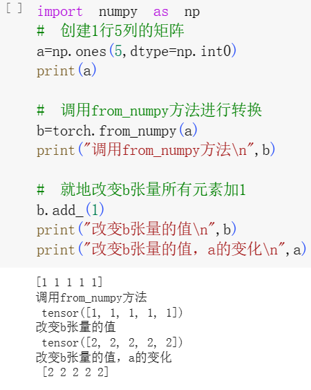 

> **所有在CPU上的Tensors, 除了CharTensor, 都可以转换为Numpy array并可以反向转换**


#### 张量移动

> **还可以使用`tensor变量名.cuda()`直接移动到GPU上**

```python
import torch

# 创建一个3*3的全1 tensor在cpu上
x=torch.ones(3,3,dtype=torch.long)
print("CPU的张量x:\n",x)

# 判断GPU是否可用
if torch.cuda.is_available:
  # 定义一个设备对象,即使用GPU
  device=torch.device("cuda")
  # 在GPU上创建一个和x一样的全1矩阵
  y=torch.ones_like(x,device=device)
  print("GPU的张量y:\n",y)

  # print(x+y) 如果用cpu的张量+gpu的张量会报错

  # 将CPU的x张量移动到GPU上
  x=x.to(device)

  z=torch.add(x,y)
  print("GPU的张量z:\n",z)

  # 将GPU的张量z移动到CPU上
  z=z.to("cpu")
  print("将z移动到cpu上:\n",z)
```

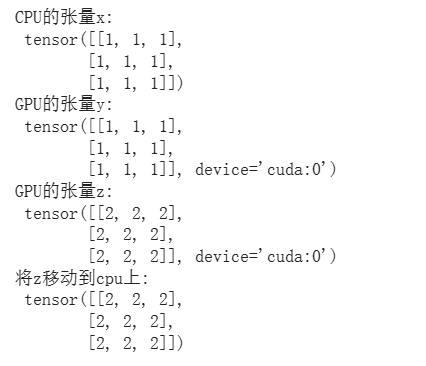 


#### autograd

> **在整个Pytorch框架中, 所有的神经网络本质上都是一个autograd package（自动求导工具包），它提供了对Tensors上所有的操作进行自动微分的功能.**

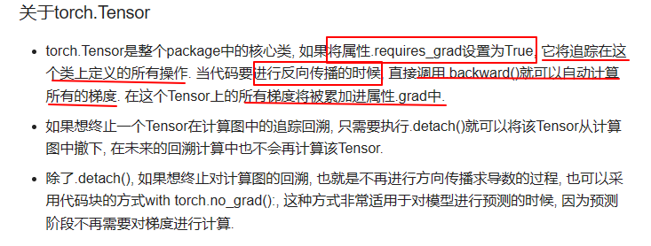

```python
import torch

# 法一:通过requires_grad创建一个需要计算梯度的tensor
x=torch.ones(3,3,requires_grad=True)
# 法二：通过就地改变属性值requires_grad_
x1=torch.ones(2,2)
x1.requires_grad_(True)

print("x:\n",x)
print("x1:\n",x1)

# 先将x所有元素*2,再求总和
y=(x*2).sum()
# 求x的均值
z=x.mean()
print("sum:\n",y)
print("mean:\n",z)
```

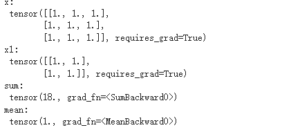 


##### 梯度Gradients

> **torch.no_grad将不会计算梯度, 也不会进行反向传播**

```python
import torch

# 创建需要计算梯度的tensor
x=torch.tensor([1.0, 2.0, 3.0],requires_grad=True)

y=x*2+1	
z=y.mean()	
print(z)
# 反向传播
z.backward() 
# 打印梯度
print(x.grad)  

print((x**2).requires_grad)

# 方法一(推荐):通过代码块的限制来停止自动求导
with torch.no_grad():
  print("方法一:\n",(x ** 2).requires_grad)

# 方法二:通过detach()获得新Tensor,拥有相同内容但不需要自动求导.
y=x.detach()
print("方法二:\n",y.requires_grad)
print(x.eq(y).all())
```

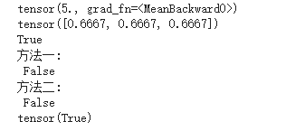 


### 常用操作

#### sum(dim=None,keepdims)

* dim：0表示对每列求和，1表示对每行求和，默认为全部元素
* keepdims：sum结果是否保持原维数，默认False

```python
# 生成一个0-5元素的2*3的tensor
x=torch.arange(6).view(2,3)

print("计算x tensor中的所有元素总和：\n",x.sum(),"\n计算x tensor中所有列的元素总和\n",x.sum(dim=0),"\n计算x tensor中所有行的元素总和：\n",x.sum(dim=1))
```

 

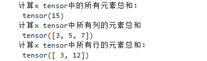 


##### 降维

```python
# 降维
x=torch.arange(12).view(-1,4)
print("x:\n",x)

# 降维：0为按照列求和，1为按照行求和
y=x.sum(dim=0)
print("x的每列求和:\n",y,"size:",y.shape)

# 对其行求和，保持原维数
z=x.sum(dim=1,keepdims=True)
print("x的每行求和:\n",z,"size:",z.shape)
```

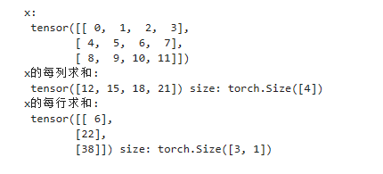 


#### max(input，dim)

* input：具体函数输出的tensor
* dim：函数索引的维度，0是每列最大值，1是每行最大值
* return：第一个tensor是每行/列最大值；第二个tensor是每行/列最大值的索引

```python
import torch
a = torch.tensor([[1,5,62,54], [2,6,2,6], [2,65,2,6]])
print("a:\n",a)
print(f"每列最大值分别是：{torch.max(a, 0)[0]},每列最大值的索引分别是：{torch.max(a, 0)[1]}")
print(f"每行最大值分别是：{torch.max(a, 1)[0]},每行最大值的索引分别是：{torch.max(a, 1)[1]}")
```

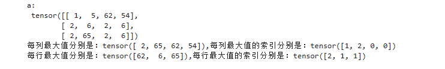 


**`注意：在多分类任务中我们并不需要知道各类别的预测概率，所以返回值的第一个tensor对分类任务没有帮助，而第二个tensor包含了预测最大概率的索引，所以在实际使用中我们仅获取第二个tensor即可。`**


#### argmax(input, dim)

* input：具体函数输出的tensor
* dim：函数索引的维度，0是每列最大值，1是每行最大值
* return  指定维度最大值的索引

```python
import torch
a = torch.tensor([[1,5,62,54], [2,6,2,6], [2,65,2,6]])
print("a:\n",a)

print(f"每列最大值索引分别是：{torch.argmax(a, 0)}")
print(f"每行最大值索引分别是：{torch.argmax(a, 1)}")
```

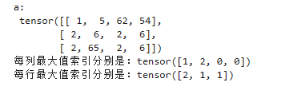 


#### unsqueeze(dim)维度扩展

> **假设对`torch.Size([m, n])`进行扩展，n可以为0**

* 0：在批处理维度上扩展（增加样本个数），变为`torch.Size([1,m,n])`，即一个样本（一个批次），每个样本是`m*n`的矩阵
* 1：变为`torch.Size([m,1,n])`，即m个样本（m个批次），每个样本是`1*n`的向量

```python
import torch

# 创建0-3的tensor
a = torch.arange(0, 4)
# 在批处理维度扩展,即变为1个批次,这个批次有4个元素
b = a.unsqueeze(0)
# 变为4个批次，1个批次中有4个元素
c = a.unsqueeze(1)
print(a,a.shape)
print(b,b.shape)
print(c,c.shape)
```

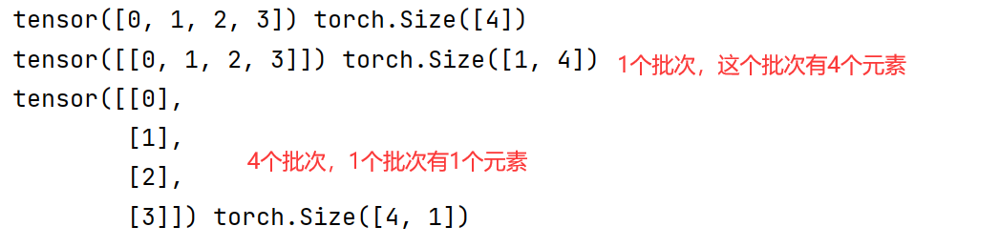


```python
import torch

# 创建0-15的4*4的tensor
a = torch.arange(0, 16).view(-1,4)
# 在批处理维度扩展,即变为1个批次,这个批次有4*4个元素(矩阵)
b = a.unsqueeze(0)
# 变为4个批次,一个批次有1*4个元素(向量)
c = a.unsqueeze(1)
print(a,a.shape)
print(b,b.shape)
print(c,c.shape)
```

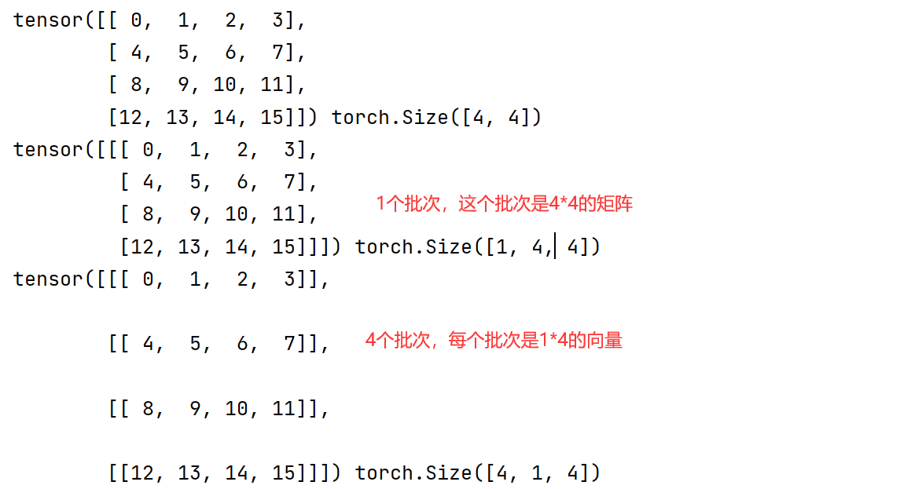


**<font color="red">注意：批次可看作一个二维数组，所以具体要看多少个批次的时候以二维数组的视角去看，多个批次合成（多个二维数组组成的数组）就是三维数组</font>**


### 神经网络

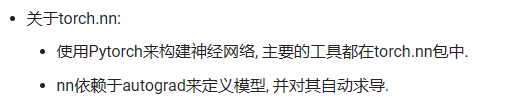 

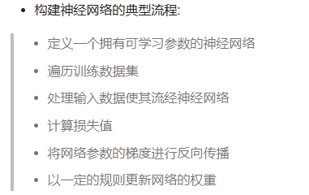 


#### 构建神经网络

```python
# torch.nn用来构建神经网络的包
import torch
import torch.nn
import torch.nn.functional as F

# 定义一个神经网络模型
class Net(nn.Module):
    def __init__(self):
        super(Net,self).__init__()
        
        # 定义第一层卷积层:输入通道1，输出通道6，卷积核大小3*3
        self.conv1=nn.Conv2d(1,6,3)
        
        # 定义第二层卷积层:输入通道6，输出通道16，卷积核大小3*3
        self.conv2=nn.Conv2d(6,16,3)
        
        # 扁平化
        self.flatten=nn.Flatten()
        
        # 定义三层全连接层
        self.fc1=nn.Linear(16*6*6,120)
        self.fc2=nn.Linear(120,84)
        self.fc3=nn.Linear(84,10)
        
    # 定义前行传播
    def forward(self,x):
        # 注意：任意卷积层后面都要加激活层，池化层
        
        # 卷积、激活
        x=F.relu(self.conv1(x))
        
        # 池化
        x=F.max_pool2d(x,(2,2))
    
        # 卷积、激活、池化
        x=F.max_pool2d(F.relu(self.conv2(x)),2)
    
        # tensor进入FC需要对其扁平化处理
        x=self.flatten(x)
    
        # 全连接、激活
        x=F.relu(self.fc1(x))
        x=F.relu(self.fc2(x))
        # 输出最后FC的结果
        x=self.fc3(x)
        return x

net=Net()
print(net)
```

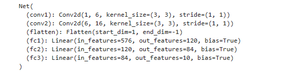


##### 测试

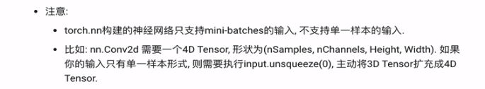 

```python
# 输入1个批次的1个灰度32*32的tensor
print("输入:")
x=torch.rand(1,1,32,32)
# 单一样本的1个灰度的32*32的tensor
y=torch.rand(1,32,32)
# 将3D tensor扩充到4D tensor
y=y.unsqueeze(0)
print("1个批次的：\n",x)
print("扩充到4D的：\n",y,y.shape)

out1=net(x)
out2=net(y)
print("输出:")
print(out1)
print(out2)
```

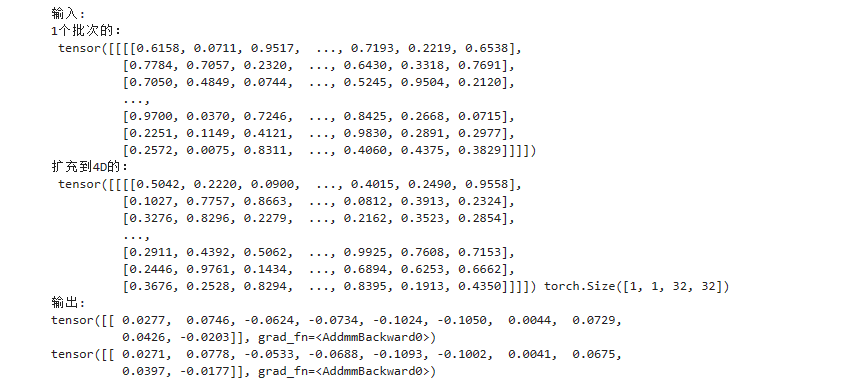


**均方误差**

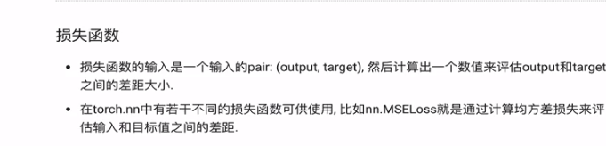 

```python
# 模拟一个10列的目标值
target=torch.randn(10)
# 将[v1,v2,v3....]的目标值改变为[[v1,v2,v3...]],因为输出值为(1,10)的tensor
target=target.view(1,10)
print(target,target.shape)

# 均方误差损失函数
loss_fn=nn.MSELoss()
loss=loss_fn(out1,target)
print("loss is :",loss)
```

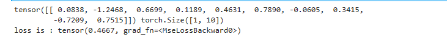


##### eg：LeNet5

```python
import torch
# 导入神经网络的层
from torch import nn

# 定义一个网络模型
class LeNet5(nn.Module):
    # 初始化网络
    def __init__(self):
        super(LeNet5,self).__init__()
        
        # 定义第一个卷积层:
        #     in_channel：输入通道为1,对应灰度图像
        #     out_channel：输出通道为6,对应6个filters
        #     kernel_size：采用5*5的卷积核
        #     padding：p=(f-1)/2,即(5-1)/2=2
        self.c1=nn.Conv2d(in_channels=1,out_channels=6,kernel_size=5,padding=2)    

        # 定义一个sigmoid激活函数
        self.Sigmoid=nn.Sigmoid()

        # 定义第一个池化层,采用avg pooling,即超参数f和s都为2，缩小一半尺寸
        self.s2=nn.AvgPool2d(kernel_size=2,stride=2)                            
        
        # 定义第二个卷积层:
        #     in_channel：输入通道为6
        #     out_channel：输出通道为16,对应16个filters
        #     kernel_size：采用5*5的卷积核
        self.c3=nn.Conv2d(in_channels=6,out_channels=16,kernel_size=5)           
        
        # 定义第二个池化层,采用avg pooling,即超参数f和s都为2，缩小一半尺寸
        self.s4=nn.AvgPool2d(kernel_size=2,stride=2)                           
        
        # 扁平化向量为一维
        self.flatten=nn.Flatten()       
        
        # 全连接层：
        #     fc1输入：将扁平化的400个特征进行线性变换，输出：映射到120个神经元上
        #     fc2输入：将fc1的120个输出作为输入，       输出：84个
        #     output输入：将fc2的84个输出作为输入       输出：0-9的特征
        self.fc1=nn.Linear(5*5*16,120)
        self.fc2=nn.Linear(120,84)
        self.output=nn.Linear(84,10)
        
        
    # 前向传播网络
    def forward(self,x):
        # 将x用第一层卷积,对结果采用sigmoid激活
        x=self.Sigmoid(self.c1(x))
       
        # 通过池化层
        x=self.s2(x)
        
        # 将x用第三层卷积,对结果采用sigmoid激活
        x=self.Sigmoid(self.c3(x))
        
        # 再通过池化层
        x=self.s4(x)
        
        # 扁平化400个特征
        x=self.flatten(x)
        
        # 全连接层
        x=self.fc1(x)
        x=self.fc2(x)
        x=self.output(x)
        # 返回10个特征
        return x
```


#### 获取模型参数

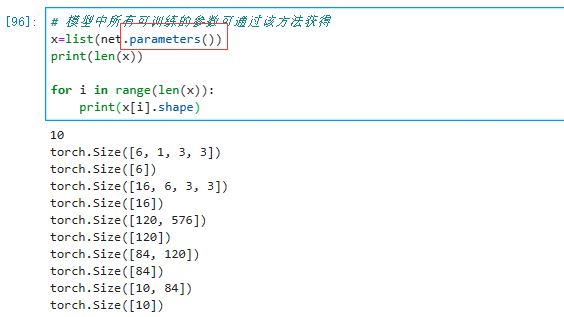 


 


