# Transformer

## Transformer架构

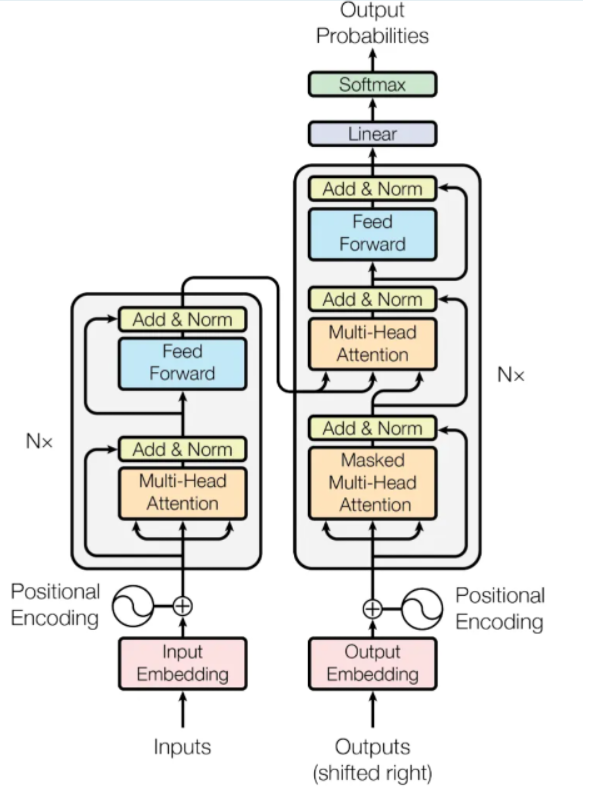

> **Embeddding层将称作文本嵌入层，Embedding层产生的张量称为词嵌入张量，它的最后一维将称作词向量等**


### **Transformer模型的作用**

- 基于seq2seq架构的transformer模型可以完成NLP领域研究的典型任务，如机器翻译,，文本生成等.。同时又可以构建预训练语言模型，用于不同任务的迁移学习。


### Transformer架构的组成

#### 输入部分

* 源文本嵌入层及其位置编码器
* 目标文本嵌入层及其位置编码器

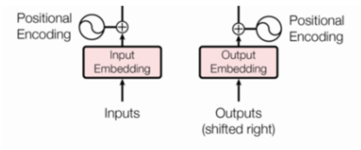 


#### 输出部分

* 线性层
* softmax层

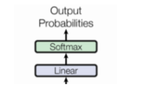 


#### 编码器部分

* 由N个编码器层堆叠而成
* 每个编码器层由两个子层连接结构组成
* 第一个子层连接结构包括一个多头自注意力子层和规范化层以及一个**`残差连接(跨层向上传递信息)`**
* 第二个子层连接结构包括一个前馈全连接子层和规范化层以及一个残差连接

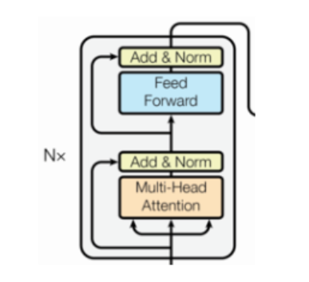  


#### 解码器部分

* 由N个解码器层堆叠而成
* 每个解码器层由三个子层连接结构组成
* 第一个子层连接结构包括一个多头自注意力子层和规范化层以及一个残差连接
* 第二个子层连接结构包括一个多头注意力子层和规范化层以及一个残差连接
* 第三个子层连接结构包括一个前馈全连接子层和规范化层以及一个残差连接

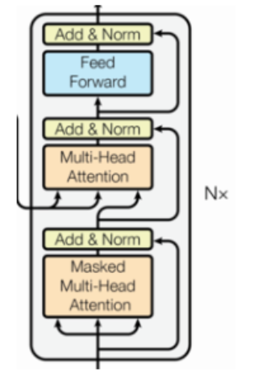 


## 输入部分

### nn.Embedding

```python
import torch
import torch.nn as nn

"""
    使用nn.Embedding创建一个嵌入层：
                num_embeddings：指定词汇表大小为10,Tensor词汇表中的索引的取值范围在0到9之间
                embedding_dim： 嵌入维度为3,这个数在一行中被映射成3列来表示
"""
embedding = nn.Embedding(num_embeddings=10, embedding_dim=3)
# 定义输入数据，是一个2x4的长整型张量
input = torch.LongTensor([[1, 2, 3, 4], [5, 6, 7, 8]])
# 对输入数据进行嵌入操作
output=embedding(input)
print(output)


"""
    使用nn.Embedding创建一个嵌入层:
           指定词汇表大小为10
           嵌入维度为3
           padding_idx:填充标记的索引为0
                    遇到值为0的位置,嵌入层使用全零向量来表示填充标记。
                    目的是为了在后续的数据处理或者模型训练过程中,能够轻松地将填充标记排除在计算之外,
                    从而避免对其进行不必要的计算和影响模型性能
"""
embedding = nn.Embedding(10, 3, padding_idx=0)
# 定义输入数据
input = torch.LongTensor([[0,2,0,5]])
# 对输入数据进行嵌入操作
output=embedding(input)
print("使用padding_idx标记：\n",output)
```

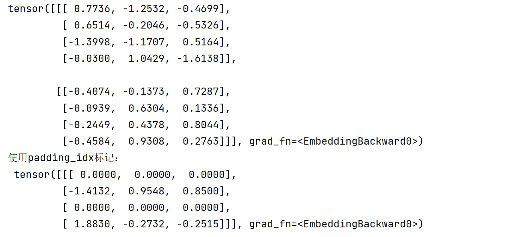


### 构建嵌入层

`myEmbeddings.py`

```python
import torch
import torch.nn as nn
import math

# 构建自定义的文本嵌入层
class Embeddings(nn.Module):
    def __init__(self, emb_nums, emb_dims):
        super(Embeddings, self).__init__()
        # 定义Embedding层
        self.lut = nn.Embedding(emb_nums, emb_dims)
        # 定义emb维度
        self.emb_dims = emb_dims

    # 前向传播
    def forward(self, x):
        # 计算x通过词汇映射后的数字张量*根号下维度的值
        x = self.lut(x) * math.sqrt(self.emb_dims)
        return x


x = torch.LongTensor([[100, 2, 421, 508], [491, 998, 1, 221]])

# 创建自定义的文本嵌入层:词汇表大小为1000,嵌入维度为512
embeddings = Embeddings(1000, 512)
# 获取词嵌入表示操作结果
output = embeddings(x)
print(embeddings,"\n",output,"\n",output.shape)
```

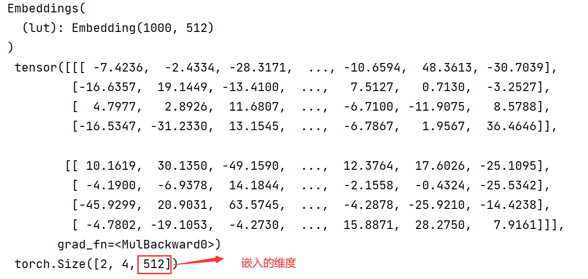


#### 文本嵌入层的作用

​				**无论是源文本嵌入还是目标文本嵌入，都是为了将文本词汇的数字表示转变为向量表示，希望在这样的高维空间捕捉词汇间的关系**


### 构建位置编码器

> **因为在Transformer的编码器结构中, 并没有针对词汇位置信息的处理，因此需要在Embedding层后加入位置编码器，将词汇位置不同可能会产生不同语义的信息加入到词嵌入张量中, 以弥补位置信息的缺失**

`myPositionalEncoding.py`

```python
import torch
import torch.nn as nn
import math
from torch.autograd import Variable

# 自定义位置编码器类
class PositionalEncoding(nn.Module):
    # emb_dims:词嵌入维度; dropout:置0的比例,让百分之多少的神经元失活; max_len:每个句子的最大长度
    def __init__(self,emb_dims,dropout,max_len=5000):
        super(PositionalEncoding, self).__init__()

        # 实例化Dropout层
        self.dropout = nn.Dropout(p=dropout)
        # 初始化一个全0的位置编码矩阵: max_len * emb_dims
        #       max_len:句子的最大长度(假设一个词只能一个字一个字划分,即可以划分max_len个字,
        #               一个字就是一行,即总共max_len行)
        #       emb_dims:词嵌入维度(一行以emb_dims的列数来表示)
        pe=torch.zeros(max_len,emb_dims)

        # 创建一个max_len*1的绝对位置矩阵: 对其扩展为max_len个批次,每个批次1个元素
        position = torch.arange(0, max_len).unsqueeze(1)

        # 创建一个1*(emb_dims/2)的tensor,步长为2:这里步长只能为2,因为只能取emb_dims中一半的元素才能分别放入pe中
        t = torch.arange(0, emb_dims, step=2)
        # torch.exp(x):创建指数为e,幂为x的tensor
        # 定义一个1*(emb_dims/2)变换矩阵
        div_term=torch.exp(t * -math.log(10000.0)/emb_dims)

        # 将变换矩阵中的偶数列赋值: position(max_len*1) * div_term(1*(emb_dims/2))=max_len*(emb_dims/2)
        pe[:,0:emb_dims:2]=torch.sin(position*div_term)
        # 将变换矩阵中的奇数列赋值: position(max_len*1) * div_term(1*(emb_dims/2))=max_len*(emb_dims/2)
        pe[:,1:emb_dims:2]=torch.cos(position*div_term)

        # 将pe二维矩阵扩充成三维矩阵:即对批次扩展,变为1个批次,这个批次是max_len * emb_dims矩阵
        pe=pe.unsqueeze(0)

        # 把pe位置编码矩阵注册成模型的buffer
        #       buffer:把它认为是对模型效果有帮助的,但却不是模型结构中超参数或者参数,
        #              不需要随着优化步骤进行更新的增益对象,
        #              可以在模型保存之后再次重加载时和模型结构与参数一同被加载
        self.register_buffer('pe', pe)

    # 前向传播: x表示文本序列的词嵌入表示
    def forward(self, x):
        # 对pe做适配工作,保留所有的批次,切行索引为0-x自身行大小,列不变
        # 并且不需要进行梯度求解
        # 用原始的词嵌入tensor + 位置编码矩阵
        x = x + Variable(self.pe[:, :x.size(1)],requires_grad=False)
        
        # 输出:加入了位置编码信息的词嵌入tensor
        return self.dropout(x)

    
dropout=0.1
# 句子长度为60
max_len=60
# 词嵌入维度为512,即这个值在一行中被映射成512列来表示
emb_dims=512

# 实例化自定义位置编码器类
pe = PositionalEncoding(emb_dims, dropout, max_len)

# 导入myEmbeddings.py文件中的output对象
from myEmbeddings import output
# 这里的output为 "自定义的文本嵌入层" 中获取词嵌入表示操作结果

result = pe(output)
print(result,result.shape)
```

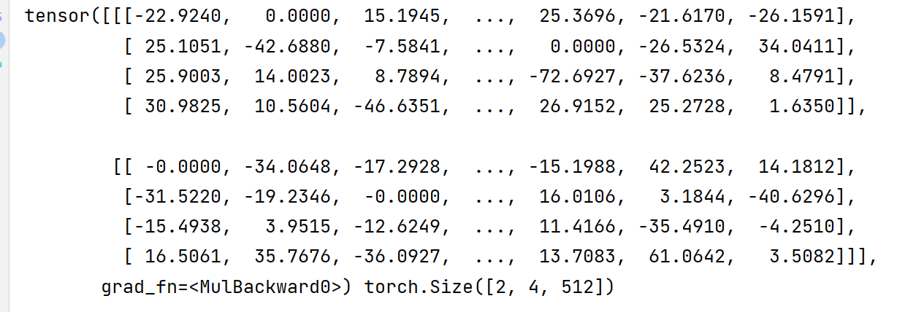


### 绘制词汇向量的特征曲线

```python
import matplotlib
import numpy as np
from matplotlib import pyplot as plt
matplotlib.use('TkAgg')
import torch

# 设置一个画布
plt.figure(figsize=(10,5))

# 实例化自定义位置编码器类,嵌入词维度20,dropout为0
from myPositionalEncoding import PositionalEncoding
pe = PositionalEncoding(emb_dims=20, dropout=0)

# 向pe传入1个批次的100*20的全0tensor:相当于展示pe的数据
output=pe(torch.zeros(1,100, 20))
# 切第一个批次,保留所有行,切索引4-7的列
plt.plot(np.arange(100), output[0, :, 4:8].data.numpy())

plt.legend(["dim %d"%p for p in [4,5,6,7]])
plt.show()
```

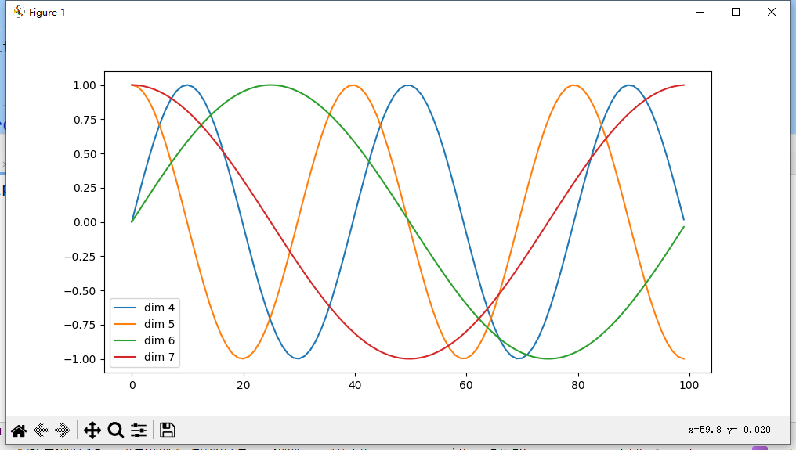


## 编码器部分

### 掩码张量

> **掩代表遮掩，码代表张量中的数值，一般为1或0（可以自定义0位置被遮掩还是1位置被遮掩），就是让另外一个张量中的一些数值被遮掩或不被遮掩，掩码张量尺寸不定**

### 作用

> **在Transformer模型中，掩码张量（Masking Tensor）被用于屏蔽（mask）序列中未来的信息，以避免模型在预测时使用未来信息，以提高模型对序列任务的处理能力，并保证模型的预测结果具有合理性和准确性。**


#### np.triu

```python
import numpy as np

a = np.triu([[1, 2, 3], [4, 5, 6], [7, 8, 9]], k=0)
b = np.triu([[1, 2, 3], [4, 5, 6], [7, 8, 9]], k=1)
c = np.triu([[1, 2, 3], [4, 5, 6], [7, 8, 9]], k=-1)
print("k=0,让主对角线以下的元素变为0:\n",a)
print("k=1,让主对角线往右上平移一格,它以下的全为0:\n",b)
print("k=-1,让主对角线往左下平移一格,它以下的全为0:\n",c)
```

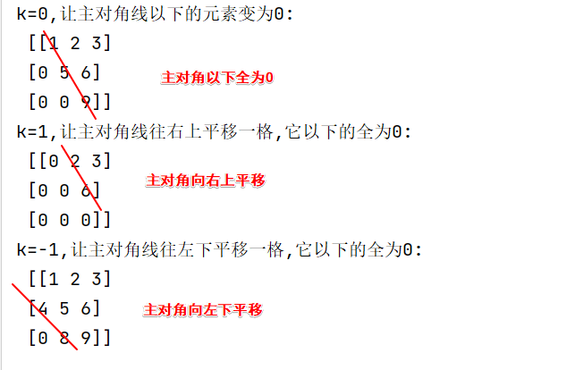 


#### 构建掩码张量

```python
import numpy as np
import torch

# 构建向后遮掩的掩码张量
def subsequent_mask(size):
    # 对其变为三维tensor
    attn_shape=(1,size,size)
    # 将主对角线往右上平移1格,生成主对角线以上全1、主对角线、主对角线以下全0的上三角矩阵
    subsequent_mask=np.triu(np.ones(attn_shape),k=1).astype("uint8")
    # 生成主对角线、主对角线以下全1、主对角线以上全0的下三角矩阵
    return torch.from_numpy(1-subsequent_mask)

# sm为三维的tensor
sm=subsequent_mask(5)
print(sm)

import matplotlib
from matplotlib import pyplot as plt
matplotlib.use('TkAgg')
plt.figure(figsize=(5,5))
# 打印出第一个批次的矩阵
plt.imshow(sm[0])
plt.show()
```

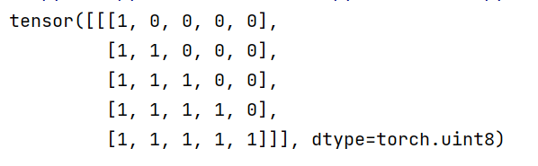 

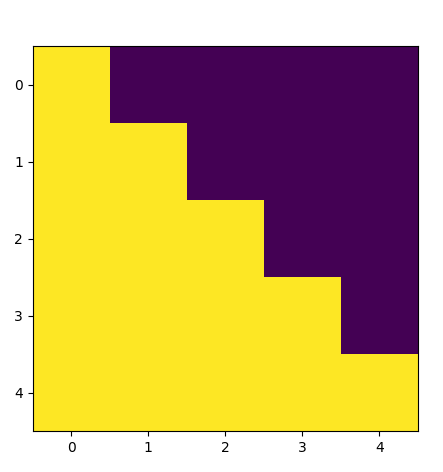 

**总结：黄色是1的部分，这里代表被遮掩； 紫色代表没有被遮掩的信息**


### attention（注意力机制）

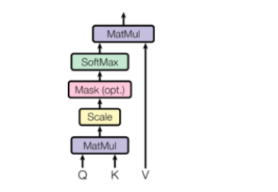 

Q和K乘法、规范化、加入掩码张量、softmax、softmax结果与V乘法

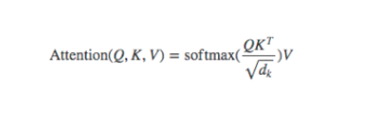 

Q、K、V的解释：

```
假如我们有一个问题: 给出一段文本，使用一些关键词对它进行描述!

为了方便统一正确答案，这道题可能预先已经写出了一些关键词作为提示。
	其中这些给出的提示就可以看作是key 
	整个的文本信息就相当于是query
	value的含义则更抽象,可以比作是你看到这段文本信息后,脑子里浮现的答案信息

这里我们又假设大家最开始都不是很聪明，第一次看到这段文本后脑子里基本上浮现的信息就只有提示这些信息，
因此key与value基本是相同的，但是随着我们对这个问题的深入理解，通过我们的思考，脑子里想起来的东西原来越多，并且能够开始对我们query也就是这段文本，提取关键信息进行表示。这就是注意力作用的过程，通过这个过程，
我们最终脑子里的value发生了变化，


key和value一般情况下默认是相同，与query是不同的，这种是我们一般的注意力输入形式

但有一种特殊情况：query与key和value相同，这种情况我们称为自注意力机制，就如同我们的刚刚的例子， 
使用一般注意力机制，是使用不同于给定文本的关键词表示它. 而自注意力机制,需要用给定文本自身来表达自己，也就是说你需要从给定文本中抽取关键词来表述它, 相当于对文本自身的一次特征提取
```


#### masked_fill

```python
import numpy as np
import torch

mask = torch.from_numpy(np.triu(torch.ones(3,3), k=0))
a=torch.arange(9).view(3,3)
# 通过掩码张量值为1的位置,将a张量中的对应位置填充为777
b = a.masked_fill(mask == 1, 777)
print("mask:\n",mask)
print("a:\n",a)
print("masked_fill的结果:\n",b)
```

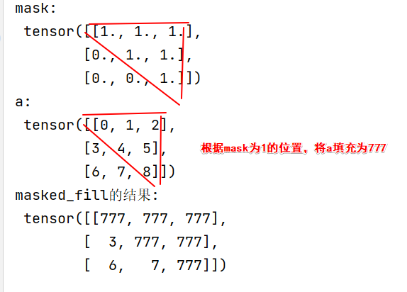 


#### transpose

```python
import torch

a = torch.arange(8).view(2, 4).unsqueeze(1)
print("a为两个批次,每个批次是1*4的矩阵：\n",a,a.shape)
# 将a的倒数第二个索引维度和倒数第一个索引维度转置,即在每个batch中转置里面的矩阵
b = a.transpose(-2,-1)
print("b为两个批次,每个批次是4*1的矩阵：\n",b,b.shape)
```

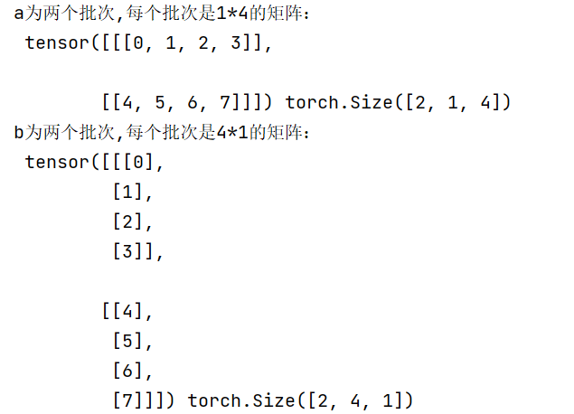 


#### 构建attention

`myattention.py`

```python
import math
import torch
import torch.nn.functional as F

# 构建attention
def attention(query,key,value,mask=None,dropout=None):
    # 将query的最后一个维度提取出来(词嵌入维度emb_dims的大小)
    d_k = query.size(-1)

    """
        注意力计算公式:Q*K转置 / 缩放系数(根号下 词嵌入维度大小)
        query为[batch,w,h]
        key.transpose为[batch,h,w]的三维tensor
    """
    scores=torch.matmul(query,key.transpose(-2,-1)) / math.sqrt(d_k)
    # 如果存在掩码张量
    if mask is not None:
        # 通过掩码张量值为0的位置,将scores张量中的对应位置填充为-10的9次方
        scores=scores.masked_fill(mask==0,-1e9)

    # 对scores最后一个维度(即[batch,w,h]的h)进行softmax操作得到注意力张量
    p_attn = F.softmax(scores, dim=-1)

    # 如果存在dropout
    if dropout is not None:
        p_attn=dropout(p_attn)

    # 根据公式将p_attn与value张量相乘获得最终的query注意力表示, 同时返回注意力张量
    return torch.matmul(p_attn, value), p_attn

# 导入自定义位置编码器的输出结果
from myPositionalEncoding import result

# 这里为自注意力机制，因为q=k=v
q=k=v=result
attn,p_attn = attention(q, k, v)
print(f"attn:\n{attn},\np_attn:\n{p_attn}")
```

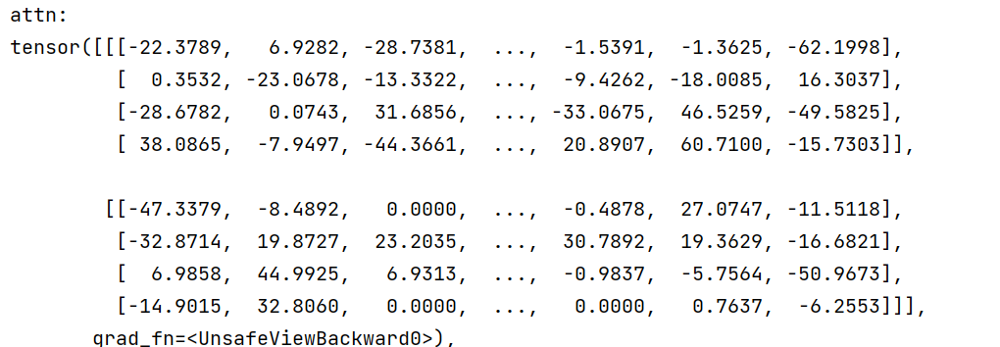  

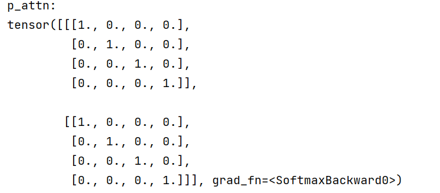  


### 多头注意力机制

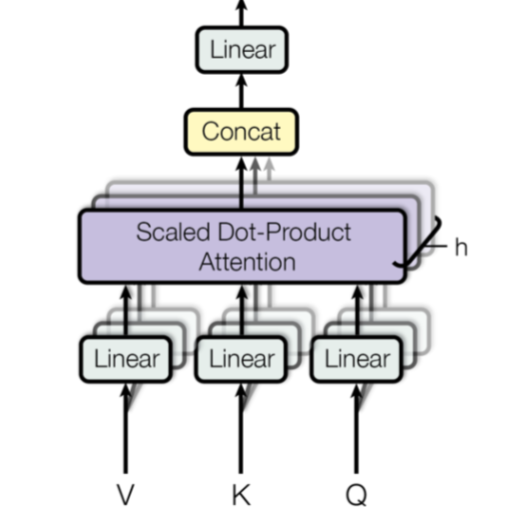

> **这种结构设计能让每个注意力机制去优化每个词汇的不同特征部分，从而均衡同一种注意力机制可能产生的偏差，让词义拥有来自更多元的表达，实验表明可以从而提升模型效果**


`myMultiHeadedAttention.py`

```python
# 用于深度拷贝的copy工具包
import copy
import torch
from torch import nn
# 导入自定义attention
from myattention import attention

# 首先需要定义克隆函数, 因为在多头注意力机制的实现中, 用到多个结构相同的线性层
def clones(module, N):
    # 通过for循环对module进行N次深度拷贝, 让每个module成为独立的层,然后放在nn.ModuleList类型的列表中
    return nn.ModuleList([copy.deepcopy(module) for _ in range(N)])


# 构建多头注意力类
class MultiHeadedAttention(nn.Module):
    def __init__(self, head, embedding_dim, dropout=0.1):
        super(MultiHeadedAttention, self).__init__()

        # 必须整除来保证每个头分配等量的词嵌入维度embedding_dim
        assert embedding_dim % head == 0

        # 得到每个头获得的分割词向量维度d_k
        self.d_k = embedding_dim // head

        self.head = head
        self.embedding_dim=embedding_dim

        # 获得四个(Q，K，V各1个+1个拼接矩阵)线性层对象:内部变换矩阵是embedding_dim x embedding_dim
        self.linears = clones(nn.Linear(embedding_dim, embedding_dim), 4)

        # 最后得到的注意力张量
        self.attn = None
        self.dropout = nn.Dropout(p=dropout)

    def forward(self, query, key, value, mask=None):
        if mask is not None:
            # 对掩码扩展维度,变为一个批次
            mask = mask.unsqueeze(0)

        # 获取query的批处理大小
        batch_size = query.size(0)

        """
        多头处理:
            1.利用zip将输入三个线性层与QKV组合,然后使用for循环分别传到线性层、x中
            2.为每个头进行线性变换,并使用view方法对线性变换的结果进行维度重塑变为4维tensor,多加了一个维度h，代表头数
            3.然后对第二维和第三维进行转置操作
        """
        query, key, value = \
            [model(x).view(batch_size, -1, self.head, self.d_k).transpose(1, 2)
             for model, x in zip(self.linears, (query, key, value))]

        # 将每个头的输出传入到attention中
        x, self.attn = attention(query, key, value, mask=mask, dropout=self.dropout)

        # 通过多头注意力计算后，得到每个头计算结果组成的4维张量，需要将其转换为输入的形状
        x = x.transpose(1, 2).contiguous().view(batch_size, -1, self.head * self.d_k)

        # 最后将x输入到线性层列表中的最后一个线性层中进行处理, 得到最终的多头注意力结构输出
        return self.linears[-1](x)

head=8
embs=512
dropout=0.2
# 导入自定义位置编码器的输出结果
from myPositionalEncoding import result
q=k=v=result
# 创建8个批次的4*4的全0掩码张量
mask=torch.zeros(8,4,4)

# 实例化多头注意力类
multi_head_attention = MultiHeadedAttention(head, embs, dropout)
result = multi_head_attention(q, k, v, mask)
print(result)
```

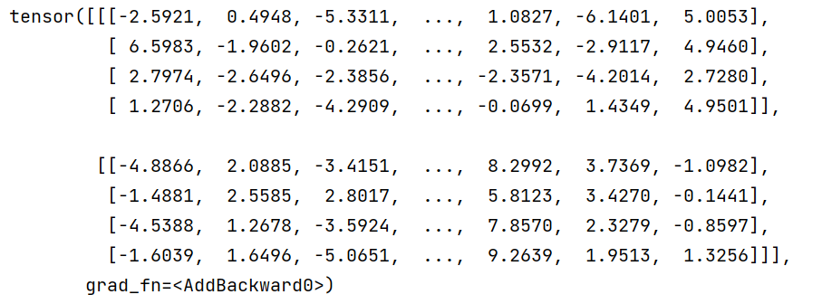


### 前馈全连接层

> **在Transformer中前馈全连接层就是具有两层线性层的全连接网络，考虑到注意力机制可能对复杂过程的拟合程度不够, 通过增加两层网络来增强模型的能力**


`myFeedForward.py`

```python
import torch
from  torch import nn
import torch.nn.functional as F

# 构建前馈全连接网络层
class FeedForward(nn.Module):
    # embedding_dim:词嵌入维度，同时也是两个线性层的输入维度和输出维度
    # d_ff:第一个线性层的输出维度和第二个线性层的输入维度
    def __init__(self,embedding_dim,d_ff,dropout=0.1):
        super(FeedForward, self).__init__()

        self.w1 = nn.Linear(embedding_dim, d_ff)
        self.w2=nn.Linear(d_ff,embedding_dim)

        self.dropout=nn.Dropout(p=dropout)

    def forward(self,x):
        return self.w2(self.dropout(F.relu(self.w1(x))))

# 词嵌入维度512
embedding_dim=512
d_ff=64
dropout=0.2

# 导入多头注意力机制的输出结果
from myMultiHeadedAttention import  result
x=result

ff=FeedForward(embedding_dim,d_ff,dropout)
ff_result = ff(x)
print(ff_result,ff_result.shape)
```

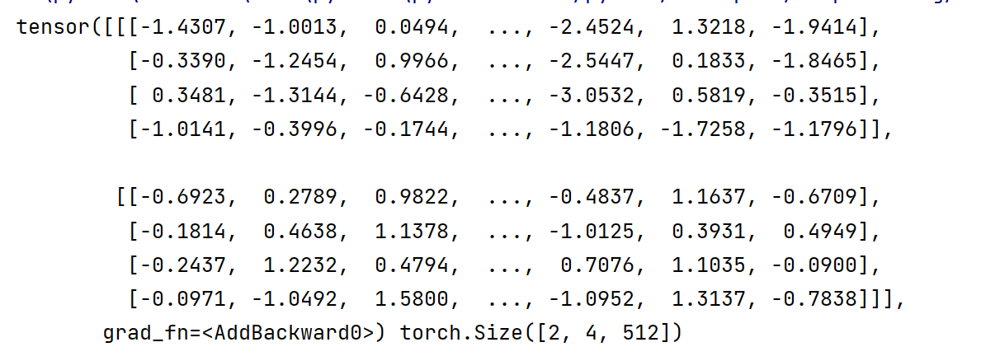


### 规范化层

> **它是所有深层网络模型都需要的标准网络层，因为随着网络层数的增加，通过多层的计算后参数可能开始出现过大或过小的情况，这样可能会导致学习过程出现异常，模型可能收敛非常的慢。因此都会在一定层数后接规范化层进行数值的规范化，使其特征数值在合理范围内。`与CNN中的BN层的思想类似`**

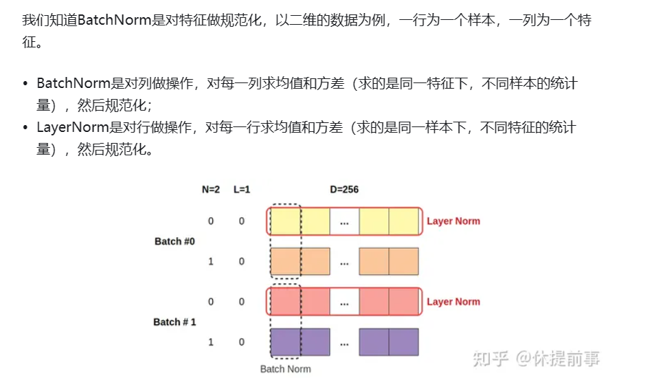


`myLayerNorm.py`

```python
import torch
from torch import nn

# 构建规范化层
class LayerNorm(nn.Module):
    # eps:一个足够小的数, 在规范化公式的分母中出现,防止分母为0
    def __init__(self,emb_dims,eps=1e-6):
        super(LayerNorm, self).__init__()

        # 初始化两个参数张量,用于对结果做规范化操作计算
        self.a2=nn.Parameter(torch.ones(emb_dims))
        self.b2=nn.Parameter(torch.zeros(emb_dims))

        self.eps=eps

    def forward(self,x):
        # 对x的最后一个维度（求出每行均值）求均值操作,保持求出的均值维度和x维度一致
        mean = x.mean(-1, keepdim=True)
        # 对x的最后一个维度（求出每行的方差）,保持求出的均值维度和x维度一致
        std=x.std(-1,keepdim=True)
        # 公式：(x-mean) /(std+α)
        return self.a2* (x-mean) / (std+self.eps) + self.b2

# 导入前馈全连接层的输出结果
from myFeedForward import ff_result

layer_norm = LayerNorm(emb_dims=512)
ln_result = layer_norm(ff_result)
print(ln_result)
```

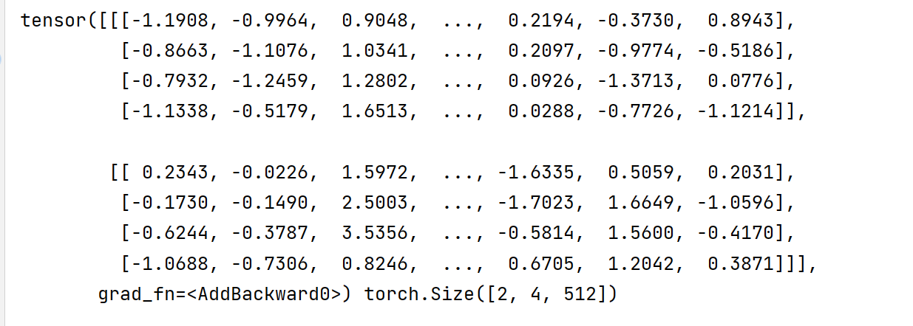


### 子层连接结构

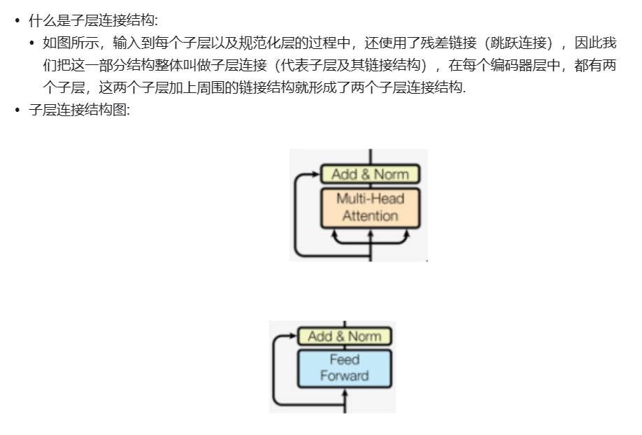

> **以这部分为例，实现子层连接**

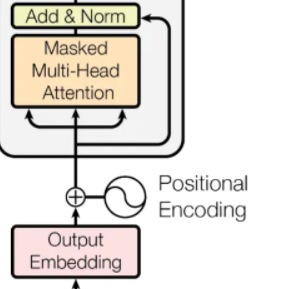 

`mySublayerConnection.py`

```python
import torch
from torch import nn

# 导入规范化层
from myLayerNorm import LayerNorm

# 构建子连接层
class SublayerConnection(nn.Module):
    def __init__(self,emb_dims,dropout=0.1):
        super(SublayerConnection, self).__init__()

        self.dropout=nn.Dropout(p=dropout)
        self.emb_dims=emb_dims
        # 规范化层
        self.ln=LayerNorm(emb_dims=emb_dims)

    # sublayer:具体传入的层（eg：前馈层 or 注意力层）
    def forward(self,x,sublayer):
        # 首先将x规范化,然后送入具体的子层进行处理,然后dropout,最后残差连接
        return x+self.dropout(sublayer(self.ln(x)))


# 导入位置编码的结果
from myPositionalEncoding import result
# 导入多头注意力机制
from myMultiHeadedAttention import MultiHeadedAttention


# 词嵌入维度
emb_dim=512
# 多头
head=8
dropout=0.2

# 创建8个批次的4*4的全0掩码张量
mask=torch.zeros(8,4,4)
# 创建多头注意力机制
multi_headed = MultiHeadedAttention(head, emb_dim)

# 自注意力机制前向传播：因为q=k=v=result
sublayer=lambda x:multi_headed(x,x,x,mask)

# 创建子连接层
sc = SublayerConnection(emb_dim, dropout)
sc_result = sc(result, sublayer)
print(sc_result)
```

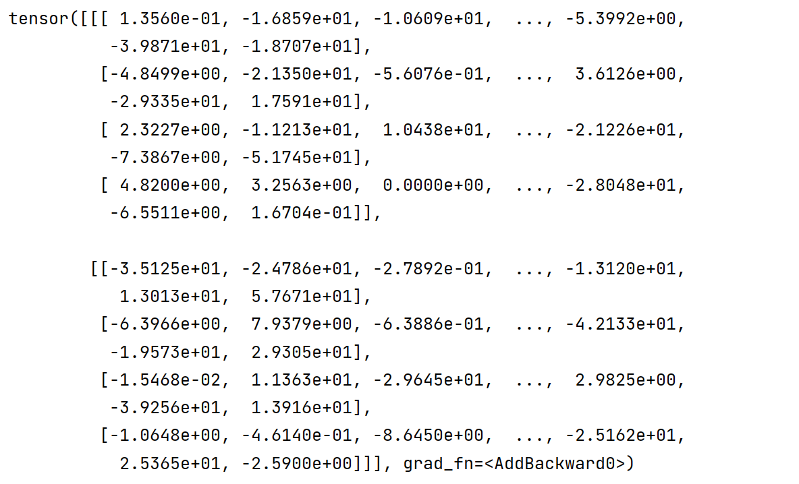


### 编码器层

> **作为编码器的组成单元, 每个编码器层完成一次对输入的特征提取过程, 即编码过程**

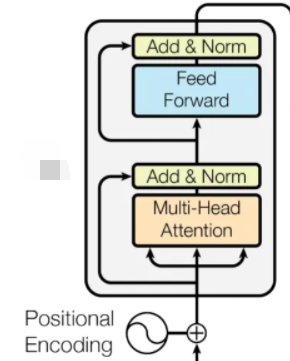


* **以上面的流程为例，实现一个编码器层**

`myEncoderLayer.py`

```python
import copy
import torch
from torch import nn

# 导入子层连接层
from mySublayerConnection import SublayerConnection


# 深度拷贝函数
def clones(module, N):
    # 通过for循环对module进行N次深度拷贝, 让每个module成为独立的层,然后放在nn.ModuleList类型的列表中
    return nn.ModuleList([copy.deepcopy(module) for _ in range(N)])


# 构建编码器层
class EncoderLayer(nn.Module):
    # self_attn:多头自注意力机制的实例化对象,feed_forward:前馈全连接层实例化对象
    def __init__(self,emb_dims,self_attn,feed_forward,dropout):
        super(EncoderLayer, self).__init__()

        self.self_attn=self_attn
        self.feed_forward=feed_forward
        self.emb_dims=emb_dims

        # 因为一个编码器层中有两个子层连接结构,克隆两个子层连接
        self.sublayer=clones(SublayerConnection(emb_dims,dropout),2)

    # mask:掩码张量
    def forward(self,x,mask):
        # 经过第一个子层连接结构:构建自注意力机制q=k=v
        x = self.sublayer[0](x, sublayer=lambda x: self.self_attn(query=x, key=x, value=x, mask=mask))
        # 经过第二个子层连接结构：前馈全连接
        return self.sublayer[1](x,sublayer=self.feed_forward)

emb_dim=512
head=8
d_ff=64
dropout=0.2

# 导入位置编码器的输出结果
from myPositionalEncoding import result
# 导入多头注意力机制
from myMultiHeadedAttention import MultiHeadedAttention
# 导入前馈全连接层
from myFeedForward import FeedForward

# 实例化多头注意力机制
self_attn = MultiHeadedAttention(head,emb_dim)
# 实例化前馈全连接层
feed_forward = FeedForward(emb_dim, d_ff, dropout)
# 创建8个批次的4*4的全0掩码张量
mask=torch.zeros(8,4,4)

encoder_layer = EncoderLayer(emb_dim, self_attn, feed_forward, dropout)
el_result = encoder_layer(result, mask)
print(el_result)
```

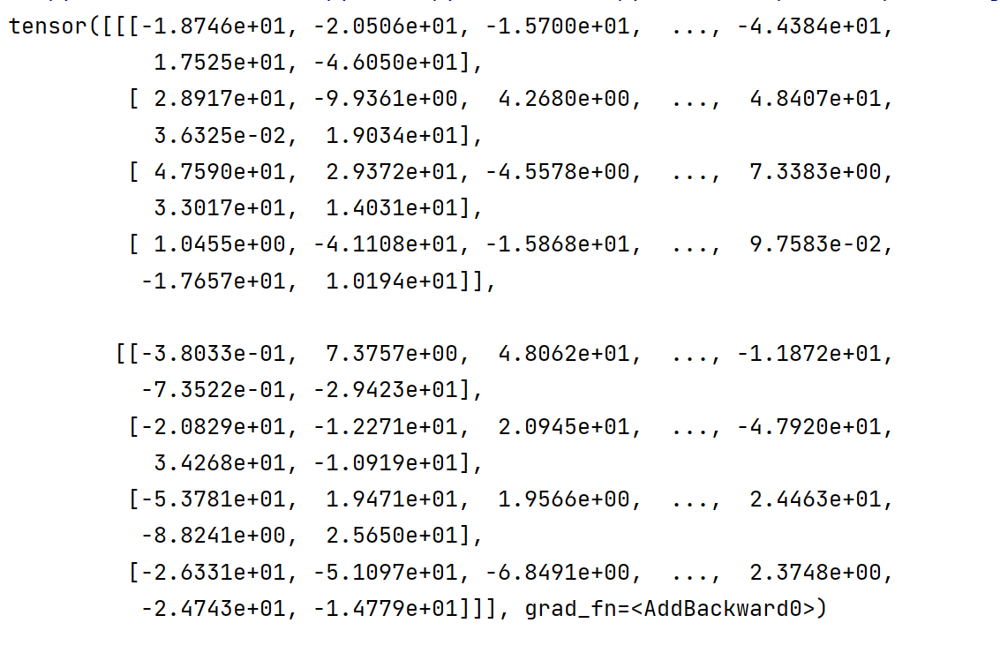


### 编码器

>  **编码器用于对输入进行指定的特征提取过程, 也称为编码, 由N个编码器层堆叠而成**

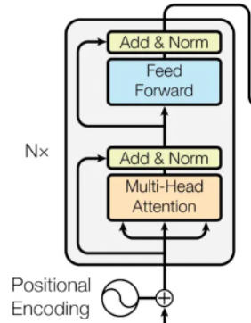


* **以上面的流程为例，将8个编码器层组成一个编码器**

`myEncoder.py`

```python
import copy
import torch
from torch import nn

# 导入规范化层
from myLayerNorm import LayerNorm


# 深度拷贝函数
def clones(module, N):
    # 通过for循环对module进行N次深度拷贝, 让每个module成为独立的层,然后放在nn.ModuleList类型的列表中
    return nn.ModuleList([copy.deepcopy(module) for _ in range(N)])

# 编码器
class Encoder(nn.Module):
    def __init__(self,encoder_layer,n):
        super(Encoder, self).__init__()

        # 克隆n个编码器层
        self.layers=clones(encoder_layer,n)
        # 规范化层:作用在编码器后
        self.norm = LayerNorm(encoder_layer.emb_dims)

    # mask:掩码张量
    def forward(self,x,mask):
        # 让x经过n个编码器层处理，最后经过规范层即可
        for layer in self.layers:
            x=layer(x,mask=mask)

        return self.norm(x)


emb_dim=512
head=8
d_ff=64
dropout=0.2

# 导入位置编码器的输出结果
from myPositionalEncoding import result
# 导入多头注意力机制
from myMultiHeadedAttention import MultiHeadedAttention
# 导入前馈全连接层
from myFeedForward import FeedForward
# 导入编码器层
from myEncoderLayer import EncoderLayer


# 实例化多头注意力机制
self_attn = MultiHeadedAttention(head,emb_dim)
# 实例化前馈全连接层
feed_forward = FeedForward(emb_dim, d_ff, dropout)
# 实例化编码器层
layer = EncoderLayer(emb_dim, self_attn, feed_forward, dropout)

# 创建8个批次的4*4的全0掩码张量
mask=torch.zeros(8,4,4)

encoder = Encoder(layer, 8)
en_result = encoder(result, mask)
print("8个编码器层组成的编码器输出结果：\n",en_result)
```

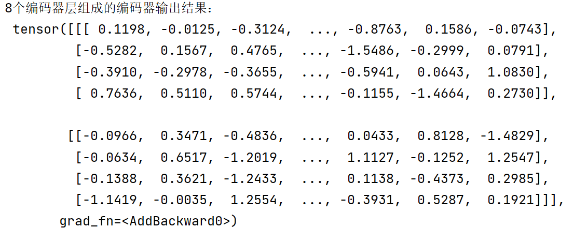
