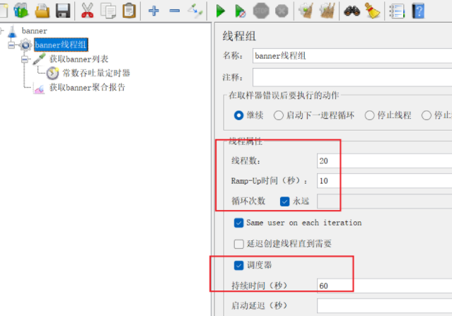
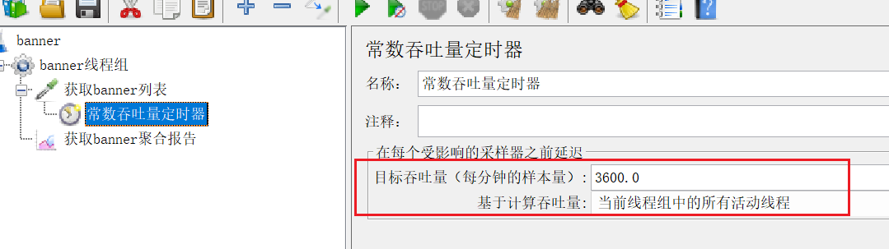
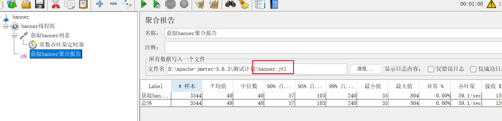

# JMeter

## 安装

* 必须先安装jdk

  

* 将`apache-jmeter-5.4.3.zip`解压到某一路径，并将`logkit-1.2.jar.zip`解压的jar包放入jmeter的lib文件夹里面


* 配置jmeter环境变量

```properties
环境变量名：JMETER_HOME
环境变量值：jmeter解压安装路径


#需要在classpath环境后追加
环境变量名：CLASSPATH
环境变量值：%JMETER_HOME%\lib\ext\ApacheJMeter_core.jar;%JMETER_HOME%\lib\jorphan.jar;%JMETER_HOME%\lib\logkit-2.0.jar; 
```


* 修改解压后jmeter的bin文件的**jmeter.properties**文件

```properties
#在#language=en下面插入一行
language=zh_CN
```


* 运行bin文件的`jmeter.bat`文件


## 开始压测

### 压测配置

```tex
测试计划
├─ 聚合报告（全局压测的总报告，填写统一jtl路径,或在每个线程组里面单独添加聚合报告也可以）
├─ 线程组A（eg:60秒、20线程，10秒热身时间,循环永远，调度器持续时间600s）
│  ├─ 接口1：banner列表
│  └─ 常数吞吐量定时器（可分别给每个接口限流，或全局限流）
└─ 线程组B
│  ├─ 接口2：用户信息
│  └─ 常数吞吐量定时器（可分别给每个接口限流，或全局限流）
```


### 线程组配置

* 线程数：相当于同时有N个真实用户发起请求
* Ramp-Up 时间（秒）：N个线程会在**X秒内逐步全部启动**，匀速加压，计算公式：`N线程 ÷ X秒 = 每秒新增Y个用户`
* 循环次数：循环指定次数或直到调度器的持续时间结束

 


### 定时器

目标吞吐量（每分钟的样本量）：**强制控制整个线程组，接口每秒稳定发送Q次请求**，不管线程多少，最终压测流量恒定**`Q/60`**QPS




### 聚合报告

* 文件名：指定压测的接口的报告名称，以`.jtl`结尾




### 导出报告

[Jmeter压测后如何导出中文版的压测报告_jmeter压测结果导出-CSDN博客](https://cesarecheung.blog.csdn.net/article/details/155306618)

```bash
# -o后的文件夹必须是空白，否则会报错
jmeter -g 指定文件.jtl -o 指定的空白文件夹 
```

